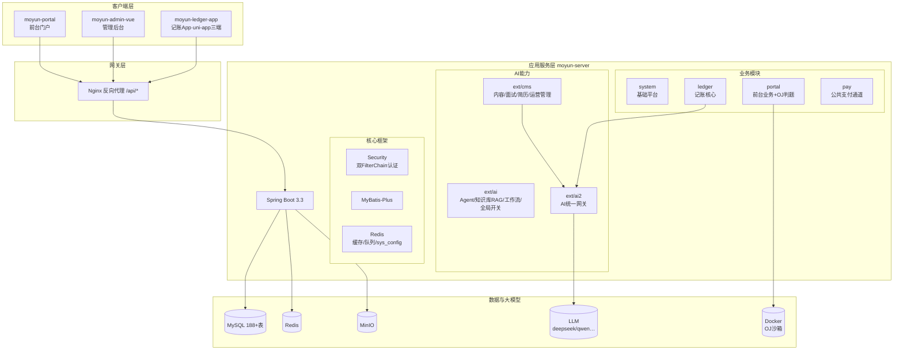
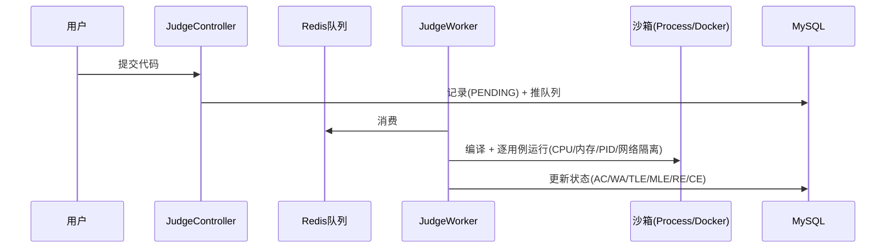

# 技术架构

> 版本：v11.98 | 更新日期：2026-09-17 | 现状全景见 [00-项目现状总结](../06-规划路线/00-项目现状总结.md)

---

## 一、技术栈总览

### 1.1 后端技术栈 (moyun-server)

| 技术 | 版本 | 用途 |
|------|------|------|
| Spring Boot | 3.3.2 | 核心框架（JDK 21） |
| MyBatis-Plus | 3.5.11 | ORM + 分页 + 代码生成 |
| Spring Security | 6.3.1 | 双 SecurityFilterChain 认证 |
| LangChain4j | 1.0.0-beta3 | AI 能力（模型接入/RAG/Agent） |
| JJWT | 0.12.3 | JWT Token 签发与验证 |
| MySQL | 8.0+ | 关系型数据库（188+ 张表） |
| Redis | 6.0+ | 缓存/限流/异步队列/sys_config 缓存 |
| MinIO | 8.5.12 | 对象存储 |
| Docker | — | OJ 判题沙箱（生产） |
| Quartz | — | 定时任务 |
| Knife4j | 4.4.0 | API 文档（/doc.html） |
| Druid | 1.2.23 | 连接池 + SQL 监控 |

### 1.2 前端技术栈

| 端 | 技术 | 用途 |
|----|------|------|
| moyun-portal | Vue 3.4 + TS + Vite + Pinia + Tailwind CSS（CSS 变量三主题） | 前台门户 |
| moyun-admin-vue | RuoYi-Vue 3.8.7 + Element Plus + ECharts | 管理后台 |
| moyun-ledger-app | Vue 3.4 + uni-app 3.0 + Pinia | 记账 App（微信小程序/H5/App） |

---

## 二、架构设计

### 2.1 整体架构图



### 2.2 后端包结构与依赖

| 模块 | 包路径 | 职责 |
|------|--------|------|
| common / util / core | com.moyun.common / util / core | 注解/工具/Security 配置/全局异常 |
| system | com.moyun.system | 用户/角色/菜单/字典/sys_config/审核任务/文件 |
| portal | com.moyun.portal | 前台业务 + OJ 判题（judge/） |
| ext/cms | com.moyun.ext.cms | 管理端内容/面试/简历/记账运营/VIP |
| ext/ai | com.moyun.ext.ai | Agent/知识库 RAG/工作流/场景解析/AiGlobalSwitch |
| ext/ai2 | com.moyun.ext.ai2 | **AI 统一网关**（场景注册/Handler/限流/熔断/执行日志） |
| ledger | com.moyun.ledger | 记账核心（账户/流水/预算/AI 财务分析） |
| pay | com.moyun.pay | 公共支付通道（微信/mock/回调/分账/提现） |

**路由约定**：前台 `/api/portal/**`（游客白名单 + 登录），管理端 `/api/cms/**` + `/api/system|monitor|tool/**`，支付回调 `/api/pay/callback/**`（免登录验签）。

### 2.3 双认证体系

```mermaid
graph LR
    subgraph 管理端认证链
        A[/system /cms /monitor **] --> B[SecurityConfig]
        B --> C[sys_user表 + TokenService]
    end
    subgraph 前台认证链
        F[/portal **] --> G[PortalSecurityConfig]
        G --> H[portal_user表 + PortalTokenService]
    end
    subgraph 安全组件
        K[XSS过滤] --> M[敏感词]
        N[限流拦截] --> O[防重复提交]
    end
```

**认证分级**：浏览/搜索免登录 → 评论/点赞/收藏/话题需登录 → 文章/专栏发布需创作者认证 → 钱包/支付需登录（银行卡/提现强制短信验证）。

**配置三层**：环境变量（密钥）→ yaml（结构化，`moyun.ai.enabled` 仅 bean 装配固定 true）→ **sys_config 运行时热配置**（`ai.global.enabled`/`voice.interview.durationMinutes`/费率等，管理台改即生效）。

---

## 三、AI 统一网关（项目核心骨架，ext/ai2）

```
业务层 input(task/context/transcript)
  → AiGatewayService：限流 → PromptInjectionGuard 输入清洗 → Token 成本熔断
  → 场景 Handler（ai_scene_config 绑定 Agent/模型/输出模式）→ LLM
  → ai_execute_log 落库 → FallbackStrategy 降级 → 业务规则兜底
```

- 场景化接入：`AiSceneJsonClient.executeForJson(sceneCode, input, userId)`；模型缓存键 `模型ID:温度:maxTokens:jsonMode`
- 安全三件套：注入防护 / 成本熔断 / 输出过滤 + JSON Schema 校验与自动修复重试
- 7/7 场景全收口（v11.59）；运行时开关 sys_config 热生效（v11.98）

## 四、AI 语音面试（旗舰）

- 对话：ASR 实时转写 → Agent 流式话术（SSE）→ TTS 播报；滑窗记忆；意图分类器打断；时长制倒计时
- 报告：逐题 LLM 分析（70/30 规则融合）+ 整场 LLM 复盘（简历+JD+对话）；异步生成防竞态；支持重新生成与 token 分享
- 详见 [AI 面试全链路实施文档](../05-方案设计-分模块/4-语音面试/AI%20面试全链路重构%20·%20完整实施文档（V2%20·%20强化版）.md)

## 五、OJ 判题架构



引擎类型后台可切（`moyun.judge.engine-type`：process=开发 / docker=生产）。

## 六、成长系统

统一事件追踪 `recordEventWithTarget`：写 growth_log → 查规则 → 算积分/经验 → 更新用户成长 → 检查徽章解锁 → 通知。事件类型与积分映射后台可配（growth-config 五 Tab）。

## 七、平台（端）维度设计

### 7.1 端定义

系统通过 `sys_platform` 表定义多端（portal/ledger/admin/personality），每端有独立的 `platform_code`。
VIP 等级、权益、会员卡、权益使用记录、接口注册表均以 `platform_code` 为维度隔离。

### 7.2 端维度覆盖

| 模块 | 表 | platform_code 覆盖 |
|------|------|------|
| VIP | vip_tier / vip_benefit / vip_user_card / vip_tier_benefit / vip_benefit_usage / vip_api_registry | ✅ 全覆盖 |
| 支付 | pay_order / pay_ledger_entry / pay_withdraw_order / pay_notification | ✅ 全覆盖（v12.3 统一） |
| 系统配置 | sys_config | ✅ 支持端级覆盖（platform_code IS NULL = 全局兜底） |
| 用户 | portal_user | ✅ 注册来源端（v12.3 补充） |

### 7.3 命名规范

- **数据库列名**：统一 `platform_code`（VARCHAR(32)），不使用 `platform`（避免歧义）
- **Java 字段**：统一 `platformCode`，getter/setter 为 `getPlatformCode()` / `setPlatformCode(String)`
- **值域**：与 `sys_platform.platform_code` 一致（portal / ledger / admin / personality）
- **费率配置**：`sys_config(config_key='pay.{platformCode}.fee-rate')` 按端配置，`PayProperties.platformFeeRate` 兜底

## 八、数据库设计

| 分类 | 前缀 | 说明 |
|------|------|------|
| 系统 | sys_ ~30 | 用户/角色/菜单/字典/配置/审核任务(sys_audit_task) |
| 门户业务 | portal_ ~80 | 文章/话题/面试/学习/成长/读书/用户/钱包 |
| AI | ai_ ~30 | 知识库/模型/Agent/**ai_scene_config/ai_execute_log** |
| 记账 | ledger_/asset_/liability_ 等 ~20 | 账户/流水/预算/分析快照 |
| 支付 | pay_ | 订单/分账/提现 |
| 定时任务 | qrtz_ ~11 | Quartz |

**金额铁律**：全项目 RMB 元，`DECIMAL(18,2)` + `BigDecimal`，禁用分/浮点。

**SQL 脚本**（`moyun-server/src/main/resources/sql/`）：
- `moyun-db-ddl.sql`：基础建表（188 表，create table if not exists 幂等）
- `202608201435-moyun-db-dml-1.sql ~ -4.sql`：种子数据（4 分片，幂等）
- `YYYYMMDD-NN-描述.sql`：增量补丁按日期顺序执行（当前最新 `20260917-01`）

> 变更惯例：DDL 追加 `ALTER TABLE` 不改原 CREATE；菜单变更走 UPDATE + 少量 INSERT。
