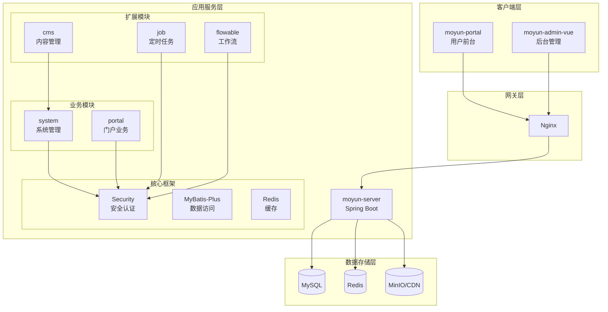
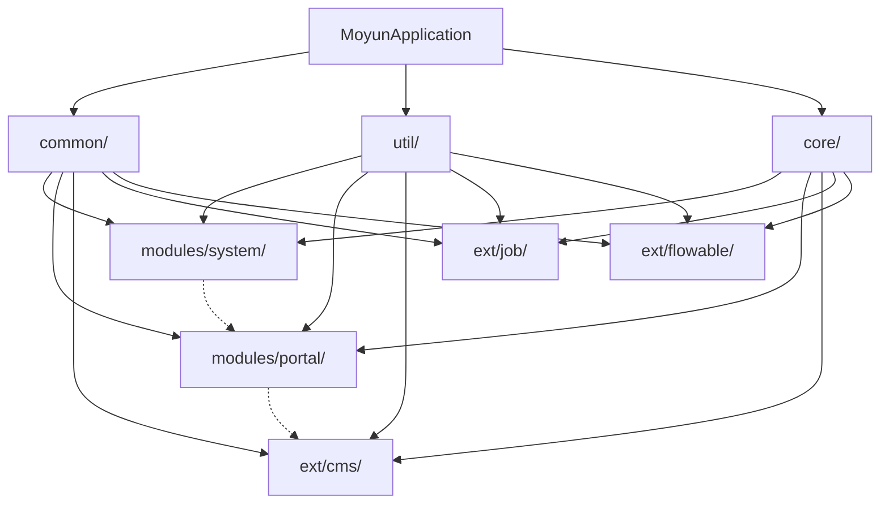
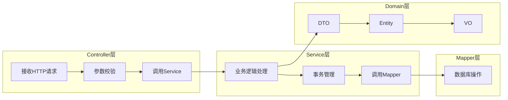
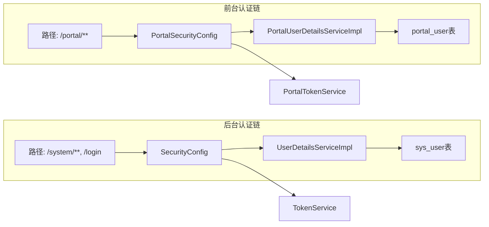
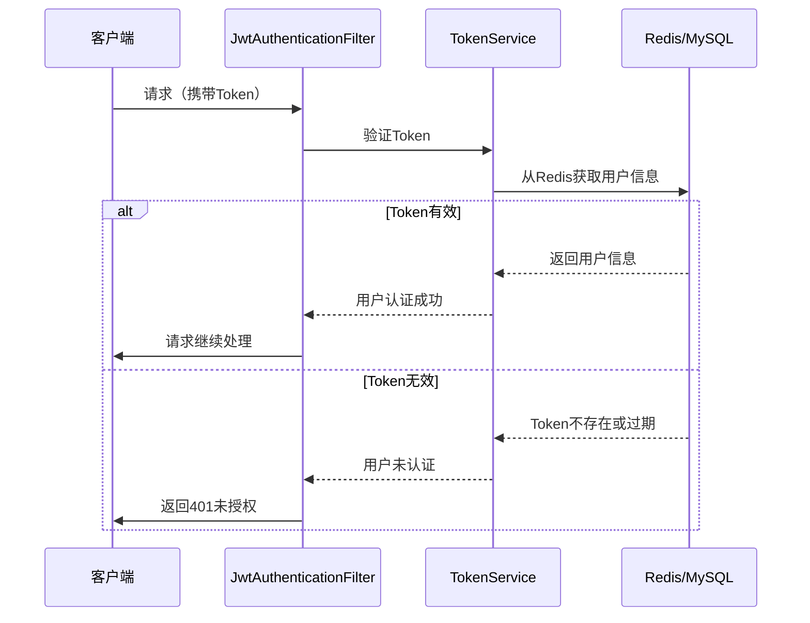
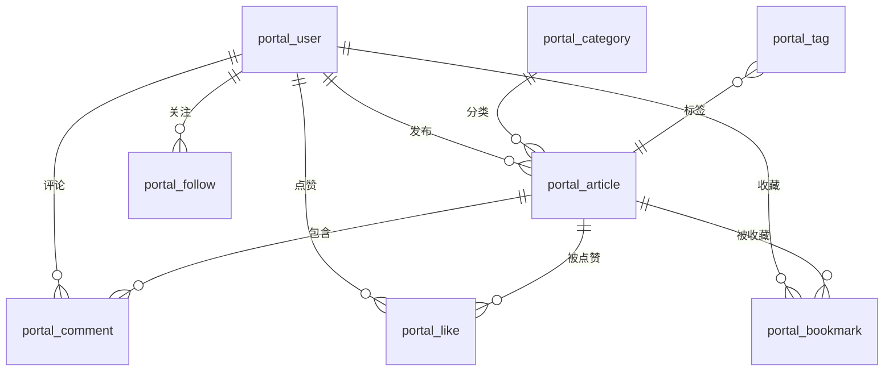

# 02_技术架构

**文档版本**: v1.0  
**创建时间**: 2026-06-15  
**最后更新**: 2026-06-15

---

## 一、技术栈总览

### 1.1 后端技术栈

| 技术 | 版本 | 用途 |
|------|------|------|
| Spring Boot | 3.3.2 | 核心框架 |
| Java | 21 | 编程语言 |
| MyBatis-Plus | 3.5.7 | ORM框架 |
| MySQL | 8.0+ | 关系型数据库 |
| Redis | 6.0+ | 缓存中间件 |
| Flowable | 7.1.0 | 工作流引擎 |
| Spring Security | 6.3.1 | 安全框架 |
| Knife4j | 4.4.0 | API文档 |
| Druid | 1.2.23 | 数据库连接池 |
| Hutool | 5.8.44 | 工具类库 |

### 1.2 前台技术栈

| 技术 | 版本 | 用途 |
|------|------|------|
| Vue | 3.4.15 | 前端框架 |
| Vite | 5.0.12 | 构建工具 |
| Vue Router | 4.2.5 | 路由管理 |
| Pinia | 3.0.4 | 状态管理 |
| Tailwind CSS | 3.4.1 | CSS框架 |
| TypeScript | 5.3.3 | 编程语言 |
| Lucide Vue | 0.511.0 | 图标库 |

### 1.3 后台管理技术栈

| 技术 | 版本 | 用途 |
|------|------|------|
| Vue | 3.4.0 | 前端框架 |
| Element Plus | 2.4.3 | UI组件库 |
| Vite | 5.0.4 | 构建工具 |
| Pinia | 2.1.7 | 状态管理 |
| ECharts | 5.4.3 | 数据可视化 |
| bpmn-js | 11.1.0 | 流程设计器 |

---

## 二、架构设计

### 2.1 整体架构图



### 2.2 模块依赖关系



**依赖规则说明**：

| 模块 | 依赖来源 | 被依赖方 | 说明 |
|------|---------|---------|------|
| **common/** | 无 | 所有模块 | 最底层，不依赖任何模块 |
| **util/** | common/ | 所有模块 | 工具模块，仅依赖common |
| **core/** | common/, util/ | 业务/扩展模块 | 核心框架，提供安全、MVC等 |
| **modules/system/** | common/, util/, core/ | 可选被portal依赖 | 系统管理业务 |
| **modules/portal/** | common/, util/, core/ | 可选被ext/cms依赖 | 门户业务 |
| **ext/cms/** | common/, util/, core/ | 无 | 内容管理扩展 |
| **ext/job/** | common/, util/, core/ | 无 | 定时任务扩展 |
| **ext/flowable/** | common/, util/, core/ | 无 | 工作流扩展 |

### 2.3 模块边界定义

| 维度 | modules/（业务模块） | ext/（扩展模块） |
|------|---------------------|-----------------|
| **定位** | 核心业务逻辑，系统必需 | 可选功能，按需启用 |
| **生命周期** | 随系统一起部署 | 可独立启用/禁用 |
| **稳定性** | 高稳定，变更需严格测试 | 相对独立，可快速迭代 |
| **耦合度** | 紧密耦合核心框架 | 松耦合，插件式集成 |
| **示例** | 用户管理、文章发布 | 定时任务、工作流、代码生成 |
| **命名约定** | `com.moyun.modules.xxx.*` | `com.moyun.ext.xxx.*` |

---

## 三、包结构

### 3.1 后端包结构

```
moyun-server/src/main/java/com/moyun/
├── common/              # 通用基础模块
│   ├── annotation/      # 注解定义
│   ├── constant/        # 常量定义
│   ├── enums/          # 枚举类
│   ├── exception/      # 异常体系
│   └── result/         # 统一返回格式
├── core/                # 核心框架模块
│   ├── base/           # 基础类
│   ├── config/         # 配置类
│   ├── security/       # 安全认证
│   ├── mvc/            # MVC相关
│   ├── aspectj/        # 切面
│   └── manager/        # 管理器
├── util/                # 工具模块
│   ├── bean/           # Bean工具
│   ├── crypto/         # 加密工具
│   ├── date/           # 日期工具
│   ├── file/           # 文件工具
│   ├── http/           # HTTP工具
│   ├── security/       # 安全工具
│   └── string/         # 字符串工具
├── modules/             # 业务模块
│   ├── system/         # 系统管理
│   │   ├── controller/
│   │   ├── service/
│   │   ├── mapper/
│   │   └── domain/
│   └── portal/         # 门户业务
│       ├── controller/
│       ├── service/
│       ├── mapper/
│       └── domain/
├── ext/                # 扩展模块
│   ├── cms/           # CMS内容管理
│   ├── job/           # 定时任务
│   ├── generator/     # 代码生成
│   └── flowable/      # 工作流
└── MoyunApplication.java
```

### 3.2 DDD 分层设计



### 3.3 DTO、VO、Query 区别

| 类型 | 全称 | 用途 | 字段 |
|------|------|------|------|
| **DTO** | Data Transfer Object | 数据传输对象，用于前后端数据交换 | 包含业务需要的字段 |
| **VO** | View Object | 视图对象，用于返回给前端展示 | 包含展示需要的字段 |
| **Query** | Query Object | 查询对象，用于封装查询条件 | 包含查询条件字段 |

---

## 五、安全架构

### 5.1 独立认证方案

**详细文档**: [moyun-server/独立认证方案说明.md](../moyun-server/独立认证方案说明.md)

### 5.2 双 SecurityFilterChain 配置



### 4.2 认证流程



---

## 五、数据库设计

### 5.1 数据库表分类

| 分类 | 前缀 | 说明 |
|------|------|------|
| 系统管理 | `sys_` | 用户、角色、菜单、权限等 |
| 门户业务 | `portal_` | 文章、用户、评论、分类等 |
| 工作流 | `act_` | Flowable工作流表 |
| 定时任务 | `qrtz_` | Quartz定时任务表 |

### 5.2 核心表关系



---

**文档维护者**: 墨韵·智库开发团队  
**最后更新**: 2026-06-15