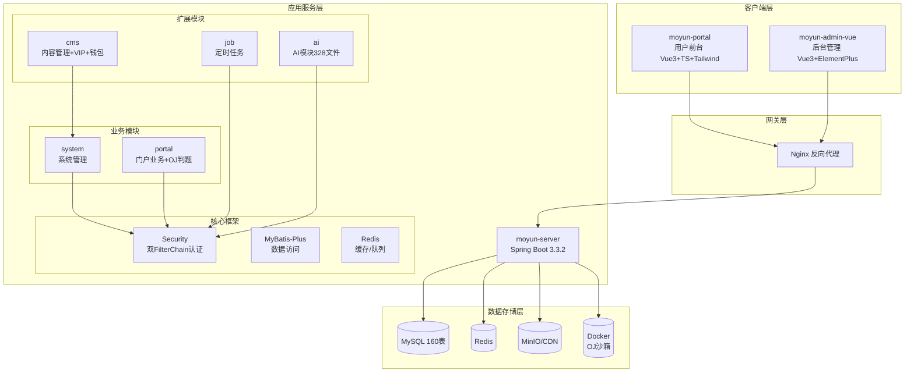
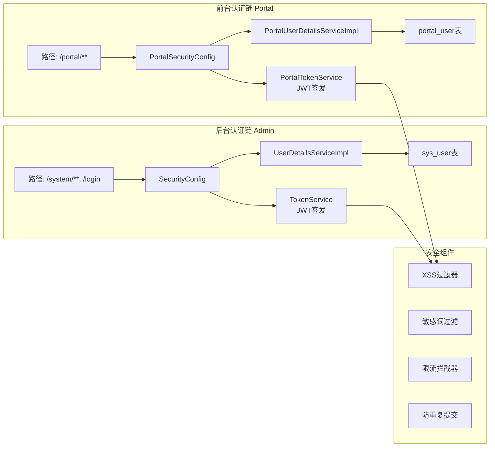
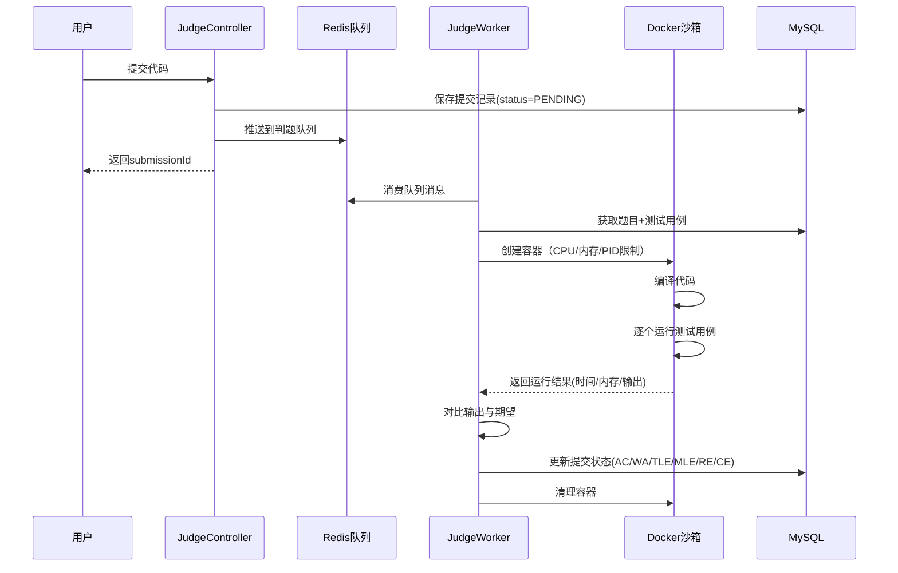
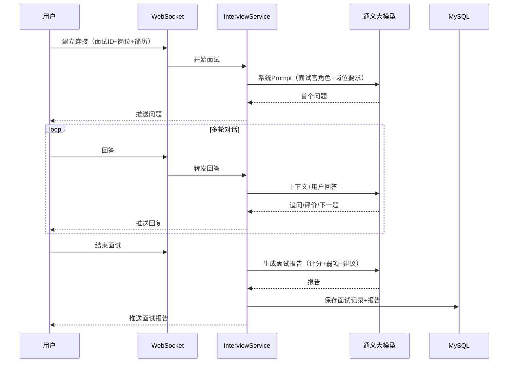

# 02_技术架构

> 版本：v9.0 | 更新日期：2026-08-15

---

## 一、技术栈总览

### 1.1 后端技术栈 (moyun-server)

| 技术 | 版本 | 用途 |
|------|------|------|
| Spring Boot | 3.3.2 | 核心框架 |
| Java | 21 (LTS) | 编程语言 |
| MyBatis-Plus | 3.5.11 | ORM + 分页 + 代码生成 |
| Spring Security | 6.3.1 | 双 SecurityFilterChain 认证 |
| LangChain4j | 1.0.0-beta3 | AI能力（面试/RAG/工作流/Agent） |
| JJWT | 0.12.3 | JWT Token 签发与验证 |
| MySQL | 8.0+ | 关系型数据库（160张表） |
| Redis | 6.0+ | 缓存/限流/异步队列/会话 |
| MinIO | 8.5.12 | 对象存储 |
| Docker | — | OJ 判题沙箱 |
| Quartz | — | 定时任务 |
| Knife4j | 4.4.0 | API 文档 |
| Druid | 1.2.23 | 数据库连接池 |
| Hutool | 5.8.44 | 工具类库 |
| PageHelper | — | 分页插件 |

### 1.2 前端门户技术栈 (moyun-portal)

| 技术 | 版本 | 用途 |
|------|------|------|
| Vue | 3.4.15 | Composition API + script setup |
| Vite | 5.0.12 | 构建工具 |
| TypeScript | 5.3.3 | 类型安全 |
| Pinia | 3.0.4 | 状态管理 |
| Vue Router | 4.2.5 | 路由管理（79条路由） |
| Tailwind CSS | — | 原子化 CSS + CSS 变量主题 |
| lucide-vue-next | — | 图标库 |

### 1.3 管理后台技术栈 (moyun-admin-vue)

| 技术 | 版本 | 用途 |
|------|------|------|
| 基础框架 | RuoYi-Vue 3.8.7 | 后台脚手架 |
| Vue | 3.4.0 | 前端框架 |
| Element Plus | 2.4.3 | 企业级 UI |
| Vite | 5.0.4 | 构建工具 |
| ECharts | 5.4.3 | 数据可视化 |

---

## 二、架构设计

### 2.1 整体架构图


```mermaid
graph TD
    subgraph 客户端层
        A[moyun-portal\n用户前台 Vue3+TS+Tailwind]
        B[moyun-admin-vue\n后台管理 Vue3+ElementPlus]
    end
    
    subgraph 网关层
        C[Nginx 反向代理]
    end
    
    subgraph 应用服务层
        D[moyun-server\nSpring Boot 3.3.2]
        subgraph 核心框架
            J[Security\n双FilterChain认证]
            K[MyBatis-Plus\n数据访问]
            L[Redis\n缓存/队列]
        end
        subgraph 业务模块
            E[system\n系统管理]
            F[portal\n门户业务+OJ判题]
        end
        subgraph 扩展模块
            G[cms\n内容管理+VIP+钱包]
            H[job\n定时任务]
            I[ai\nAI模块328文件]
        end
    end
    
    subgraph 数据存储层
        M[(MySQL 160表)]
        N[(Redis)]
        O[(MinIO/CDN)]
        P[(Docker\nOJ沙箱)]
    end
    
    A --> C
    B --> C
    C --> D
    D --> M
    D --> N
    D --> O
    D --> P
    E --> J
    F --> J
    G --> E
    H --> J
    I --> J
```

### 2.2 模块依赖关系

| 模块 | 包路径 | 依赖 | 被依赖 | 说明 |
|------|--------|------|--------|------|
| common/ | com.moyun.common | 无 | 所有模块 | 注解/常量/枚举/异常/统一返回 |
| util/ | com.moyun.util | common | 所有模块 | 加密/日期/文件/HTTP/字符串工具 |
| core/ | com.moyun.core | common, util | 业务/扩展 | Security/MVC/切面/配置 |
| system/ | com.moyun.modules.system | core | portal, ext | 用户/角色/菜单/字典/日志/通知/敏感词 |
| portal/ | com.moyun.modules.portal | core, system | ext/cms | 门户业务 + OJ判题引擎 |
| ext/cms/ | com.moyun.ext.cms | core, portal | 无 | 内容管理 + VIP + 钱包 + 仪表板 |
| ext/ai/ | com.moyun.ext.ai | core, portal | 无 | 知识库RAG/图表分析/工作流/Agent |
| ext/job/ | com.moyun.ext.job | core | 无 | 定时任务 |

### 2.3 双认证体系


```mermaid
graph LR
    subgraph 后台认证链 Admin
        A[路径: /system/**, /login] --> B[SecurityConfig]
        B --> C[UserDetailsServiceImpl]
        C --> D[sys_user表]
        B --> E[TokenService\nJWT签发]
    end
    
    subgraph 前台认证链 Portal
        F[路径: /portal/**] --> G[PortalSecurityConfig]
        G --> H[PortalUserDetailsServiceImpl]
        H --> I[portal_user表]
        G --> J[PortalTokenService\nJWT签发]
    end
    
    subgraph 安全组件
        K[XSS过滤器]
        L[敏感词过滤]
        M[限流拦截器]
        N[防重复提交]
    end
    
    E --> K
    J --> K
```

**认证分级（v9.0）**：

| 操作 | 认证要求 |
|------|----------|
| 浏览/搜索/阅读 | 无需登录 |
| 评论/点赞/收藏 | 仅需登录 |
| 话题发布 | 仅需登录（v9.0降级） |
| 文章/专栏/面试经验发布 | 需创作者认证 |
| 钱包/VIP操作 | 需登录 + 实名 |

---

## 三、后端包结构

```
moyun-server/src/main/java/com/moyun/
├── common/              # 通用基础
│   ├── annotation/      # 注解（@RateLimit @RepeatSubmit等）
│   ├── constant/        # 常量
│   ├── enums/          # 枚举
│   ├── exception/      # 异常体系
│   └── result/         # 统一返回格式
├── core/                # 核心框架
│   ├── base/           # BaseController/BaseEntity
│   ├── config/         # 配置类（Redis/WebMvc/Cors等）
│   ├── security/       # SecurityConfig + PortalSecurityConfig
│   ├── mvc/            # MVC拦截器/过滤器
│   ├── aspectj/        # AOP切面（日志/限流/数据权限）
│   └── manager/        # 管理器（Token/Async/File）
├── util/                # 工具模块
├── modules/
│   ├── system/         # 系统管理（用户/角色/菜单/字典/日志/通知/敏感词/配置）
│   └── portal/         # 门户业务
│       ├── controller/ # Portal*Controller（前台API）
│       ├── service/    # IPortal*Service + Impl
│       ├── domain/     # Entity / DTO / VO / Query
│       ├── mapper/     # MyBatis-Plus Mapper + XML
│       ├── judge/      # OJ判题引擎
│       │   ├── config/     # Docker配置
│       │   ├── runner/     # 代码执行器（多语言）
│       │   ├── queue/      # 异步判题队列
│       │   └── checker/    # 结果校验器
│       └── config/     # Portal配置
├── ext/
│   ├── cms/            # CMS后台管理
│   │   ├── controller/ # Cms*Controller（文章/专栏/面试/读书/成长/广告/VIP/钱包/仪表板）
│   │   └── service/    # ICms*Service
│   ├── ai/             # AI模块（328文件）
│   │   ├── controller/ # 知识库/模型/工作流/Agent/Token
│   │   ├── service/    # RAG/图表分析/SQL问答
│   │   ├── rag/        # 向量检索
│   │   └── agent/      # Agent执行引擎
│   ├── job/            # 定时任务
│   └── generator/      # 代码生成
└── MoyunApplication.java
```

---

## 四、OJ 判题架构

### 4.1 判题流程


```mermaid
sequenceDiagram
    participant U as 用户
    participant API as JudgeController
    participant Q as Redis队列
    participant W as JudgeWorker
    participant D as Docker沙箱
    participant DB as MySQL
    
    U->>API: 提交代码
    API->>DB: 保存提交记录(status=PENDING)
    API->>Q: 推送到判题队列
    API-->>U: 返回submissionId
    
    W->>Q: 消费队列消息
    W->>DB: 获取题目+测试用例
    W->>D: 创建容器（CPU/内存/PID限制）
    D->>D: 编译代码
    D->>D: 逐个运行测试用例
    D-->>W: 返回运行结果(时间/内存/输出)
    W->>W: 对比输出与期望
    W->>DB: 更新提交状态(AC/WA/TLE/MLE/RE/CE)
    W->>D: 清理容器
```

### 4.2 安全隔离

| 维度 | 限制 |
|------|------|
| CPU | `--cpus=1` |
| 内存 | `--memory=256m` |
| 进程数 | `--pids-limit=50` |
| 网络 | `--network=none` |
| 文件系统 | 只读根 + 临时tmpfs |
| 超时 | 可配置（默认5秒） |

---

## 五、AI 模块架构

### 5.1 模块组成

| 子模块 | 说明 | 技术 |
|--------|------|------|
| AI 模拟面试 | 多轮对话面试 + 智能评分 | LangChain4j + 通义大模型 + WebSocket |
| 知识库 RAG | 文档导入 + 向量化 + 语义搜索 | LangChain4j Embedding + 向量库 |
| 图表分析 | 自然语言生成图表 | LLM + ECharts配置生成 |
| SQL 问答 | 自然语言查询数据库 | LLM + SQL生成 + 结果可视化 |
| 工作流 | 可视化AI工作流编排 | 自研DAG执行引擎 |
| Agent | 自主任务执行 | LangChain4j Agent + 工具调用 |

### 5.2 面试AI流程


```mermaid
sequenceDiagram
    participant U as 用户
    participant WS as WebSocket
    participant S as InterviewService
    participant LLM as 通义大模型
    participant DB as MySQL
    
    U->>WS: 建立连接（面试ID+岗位+简历）
    WS->>S: 开始面试
    S->>LLM: 系统Prompt（面试官角色+岗位要求）
    LLM-->>S: 首个问题
    S-->>U: 推送问题
    
    loop 多轮对话
        U->>WS: 回答
        WS->>S: 转发回答
        S->>LLM: 上下文+用户回答
        LLM-->>S: 追问/评价/下一题
        S-->>U: 推送回复
    end
    
    U->>WS: 结束面试
    S->>LLM: 生成面试报告（评分+弱项+建议）
    LLM-->>S: 报告
    S->>DB: 保存面试记录+报告
    S-->>U: 推送面试报告
```

---

## 六、成长系统架构

### 6.1 统一事件追踪

```
recordEventWithTarget(userId, eventType, targetId, targetType, metadata)
    │
    ├── 写入 portal_growth_log（成长日志）
    ├── 查询 portal_growth_rule（成长规则）
    ├── 计算积分/经验值增量
    ├── 更新 portal_user_growth（用户成长数据）
    ├── 检查徽章/成就解锁条件
    └── 触发通知
```

### 6.2 事件类型

| 事件类型 | 触发模块 | 积分/经验 |
|----------|----------|-----------|
| ARTICLE_PUBLISH | 文章 | +50 |
| ARTICLE_LIKED | 文章 | +5 |
| TOPIC_CREATE | 话题 | +10 |
| INTERVIEW_COMPLETE | 面试 | +30 |
| QUESTION_SOLVED | 学习/OJ | +20 |
| READING_CHAPTER | 读书 | +5 |
| DAILY_SIGN_IN | 签到 | +1~10 |
| ... | ... | 后台可配置 |

### 6.3 后台管理（growth-config 5 Tab）

| Tab | 说明 |
|-----|------|
| 规则 | 成长规则CRUD（事件类型→积分/经验映射） |
| 成就 | 成就定义与解锁条件 |
| 徽章 | 徽章图标与展示 |
| 日志 | 成长日志查询 |
| 用户 | 用户成长数据查询 |

---

## 七、数据库设计

### 7.1 表分类

| 分类 | 前缀 | 表数量 | 说明 |
|------|------|--------|------|
| 系统管理 | sys_ | ~30 | 用户/角色/菜单/权限/字典/配置/日志/通知 |
| 门户业务 | portal_ | ~80 | 文章/话题/面试/学习/成长/读书/用户/钱包/广告 |
| AI 模块 | ai_ | ~20 | 知识库/模型/工作流/Agent/Token |
| 定时任务 | qrtz_ | ~11 | Quartz定时任务 |
| 广告 | ad_ | ~5 | 广告位/投放记录 |

### 7.2 v9.0 表变更

| 操作 | 表名 | 说明 |
|------|------|------|
| DROP | portal_pk_challenge | PK对战挑战表 |
| DROP | portal_circle | 圈子表 |
| DROP | portal_circle_member | 圈子成员表 |
| DROP | portal_circle_post | 圈子帖子表 |
| 保留 | portal_tip_order | 打赏/付费阅读订单（Portal端付费阅读 + Admin端打赏流水Tab共用，v9.5 起 Admin 依赖 CmsTipService 查询此表） |

### 7.3 SQL 脚本

| 脚本 | 用途 |
|------|------|
| init_v7.8.sql | 全量初始化（160张表，已清理PK建表语句） |
| upgrade_v8.1_audit_unified.sql | v8.1 审核模块统一整合（sys_audit_task + 任务管理菜单，幂等执行） |
| upgrade_v8.2_import_template.sql | v8.2 通用导入模板配置 + 题库导入导出权限（幂等执行） |
| upgrade_v9.0_admin_refactor.sql | v9.0升级脚本（14部分，幂等执行） |
| upgrade_v9.5_merge.sql | v9.5合并版脚本（恢复portal:tip:list/query按钮权限，幂等执行） |
| upgrade_v9.6_admin_optimize.sql | v9.6后台体检脚本（菜单收敛：知识中心M→C/审核入口收敛/认证扁平化/征文+提示词菜单注册 + 27类业务字典，幂等执行） |

> 执行顺序：init_v7.8 → v8.1 → v8.2 → v9.0 → v9.5 → v9.6（全部幂等，可重复执行）
