# 🚀 Lynx AI - 企业级智能体管理平台

<div align="center">


**新一代企业级AI智能体编排与管理平台**

[](https://gitee.com/lynx-ai/lynx-ai/stargazers)
[](LICENSE)
[](https://www.oracle.com/java/)
[](https://spring.io/projects/spring-boot)
[](https://github.com/langchain4j/langchain4j)
[](https://vuejs.org/)

[🚀 快速开始](#快速开始) | [💡 核心功能](#核心功能) | [🏗️ 技术架构](#技术架构) | [📖 文档](#详细文档) | [🤝 贡献](#贡献指南)

</div>

---

## 📖 项目简介

**Lynx AI** 是一个功能强大的企业级AI智能体管理平台，提供从智能体创建、知识库管理、工作流编排到自然语言数据分析的完整AI解决方案。平台特别创新性地实现了**AI数据分析**功能，让非技术人员也能通过自然语言查询和分析数据。

### ✨ 项目特色

- 🎯 **零代码创建智能体** - 可视化配置，5分钟上线AI助手
- 📊 **AI数据分析** - 用自然语言查询MySQL/Elasticsearch，无需SQL/DSL
- 📚 **企业级RAG** - 知识库管理，让AI具备专业领域知识
- 🔄 **可视化工作流** - 拖拽式编排，自动化复杂AI任务
- 🔧 **Function Calling** - 内置多种工具，扩展AI能力
- 💰 **完整Token统计** - 多维度成本分析，精准控制预算


### 🎯 核心价值

- **💬 AI数据分析** - 用自然语言查询MySQL/ES，无需SQL/DSL，业务人员也能轻松分析数据
- **🤖 零代码智能体** - 可视化界面创建AI助手，无需编程，5分钟上线
- **📚 企业级知识库** - RAG技术，让AI具备专业领域知识，精准回答业务问题
- **🔄 可视化工作流** - 拖拽式编排，自动化复杂AI任务流程
- **📊 智能大屏** - 实时监控系统运行、Token消耗、成本分析
- **🔧 Function Calling** - 内置多种工具，扩展AI能力边界

---

## 🚀 快速开始

### 环境要求

```
JDK 17+
Node.js 18+
MySQL 8.0+
Redis 7.0+
Elasticsearch 8.14.3
Maven 3.6+
```

**可选依赖：**
- **MinIO** - 对象存储（用于存储上传的文档和图片，不使用可跳过）
- **LibreOffice** - 文档转PDF（⭐推荐安装，转换为PDF后可实现精准的原文定位功能）

### 安装依赖服务

#### 1. 安装MySQL 8.0

**Windows:**
- 下载：https://dev.mysql.com/downloads/mysql/
- 安装后启动MySQL服务

**Linux/Mac:**
```bash
# Ubuntu/Debian
sudo apt-get install mysql-server

# CentOS/RHEL
sudo yum install mysql-server

# Mac
brew install mysql
```

#### 2. 安装Redis 7.0

**Windows:**
- 下载：https://github.com/tporadowski/redis/releases
- 解压后运行 `redis-server.exe`

**Linux/Mac:**
```bash
# Ubuntu/Debian
sudo apt-get install redis-server

# CentOS/RHEL
sudo yum install redis

# Mac
brew install redis
```

#### 3. 安装Elasticsearch 8.14.3

**下载地址：** https://www.elastic.co/downloads/elasticsearch

**启动：**
```bash
# Windows
bin\elasticsearch.bat

# Linux/Mac
bin/elasticsearch
```

**配置（可选）：**
```yaml
# config/elasticsearch.yml
xpack.security.enabled: true
xpack.security.http.ssl.enabled: false
```

#### 4. 安装MinIO（可选）

**说明：** 用于存储上传的文档和图片。如果不需要文档上传功能，可以跳过此步骤。

**下载地址：** https://min.io/download

**启动：**
```bash
# Windows
minio.exe server D:\minio-data

# Linux/Mac
./minio server /data
```

**配置：**
- 默认用户名：minioadmin
- 默认密码：minioadmin
- 访问地址：http://localhost:9000

#### 5. 安装LibreOffice（推荐）

**说明：** 用于将Word/Excel/PPT文档转换为PDF格式。

**⭐ 为什么推荐安装？**
- 转换为PDF后，可以实现**精准的原文定位**功能
- 在RAG检索时，能够准确定位到文档的具体页码和位置
- 提升知识库的可追溯性和用户体验

**下载地址：** https://www.libreoffice.org/download/download/

**安装路径：**
- Windows: `C:\Program Files\LibreOffice` 或 `D:\Program Files\LibreOffice`
- Linux: `/usr/lib/libreoffice`
- Mac: `/Applications/LibreOffice.app/Contents`

**配置：**
安装后需要在 `application.properties` 中配置安装路径：
```properties
libreoffice.home=D:/Program Files/LibreOffice
```

### 后端启动

```bash
# 1. 克隆项目
git clone https://gitee.com/lynx-ai/lynx-ai.git
cd lynx-ai

# 2. 初始化数据库
mysql -u root -p
CREATE DATABASE `lynx-ai` DEFAULT CHARACTER SET utf8mb4 COLLATE utf8mb4_unicode_ci;
USE `lynx-ai`;
SOURCE lynx-ai-parent/lynx-ai-web/src/main/resources/sql/lynx-ai.sql;

# 3. 配置后端
cd lynx-ai-parent/lynx-ai-web/src/main/resources
# 编辑 application.properties，配置以下【必填】项：

# MySQL配置（注意数据库名是 lynx-ai）
spring.datasource.url=jdbc:mysql://localhost:3306/lynx-ai?useUnicode=true&characterEncoding=UTF-8&serverTimezone=Asia/Shanghai&useSSL=false
spring.datasource.username=root
spring.datasource.password=your_password

# Redis配置（如果没有密码则留空）
spring.data.redis.host=localhost
spring.data.redis.password=

# Elasticsearch配置
elasticsearch.host=localhost
elasticsearch.username=elastic
elasticsearch.password=your_password

# AI模型API Key（至少配置一个）
dashscope.api-key=your_dashscope_api_key
# 或
# openai.api-key=your_openai_api_key

# MinIO配置（可选，如果不使用文档上传功能可以注释掉）
# minio.endpoint=http://localhost:9000
# minio.access-key=minioadmin
# minio.secret-key=minioadmin

# LibreOffice配置（推荐安装，用于文档转PDF实现原文定位）
# Windows示例：D:/Program Files/LibreOffice
# Linux示例：/usr/lib/libreoffice
# Mac示例：/Applications/LibreOffice.app/Contents
# libreoffice.home=D:/Program Files/LibreOffice

# 4. 启动后端服务
cd lynx-ai-parent
mvn clean install
cd lynx-ai-web
mvn spring-boot:run

# 后端启动成功后访问：http://localhost:8080
# Swagger API文档：http://localhost:8080/doc.html
```

**配置说明：**

所有配置项都有详细的中文注释，包括：
- 📝 配置项的作用说明
- 💡 推荐值和默认值
- ⚠️ 注意事项
- 🎯 适用场景

详见 `application.properties` 文件。

### 前端启动

```bash
# 1. 进入前端目录
cd lynx-ai-ui

# 2. 安装依赖
npm install
# 或使用 pnpm（推荐，速度更快）
npm install -g pnpm
pnpm install

# 3. 配置后端API地址
# 编辑 .env.development 文件
VITE_API_BASE_URL=http://localhost:8080

# 4. 启动前端服务
npm run dev

# 前端启动成功后访问：http://localhost:5173
```

### 默认账号

```
用户名：laomao
密码：laomao123456
```

### 验证安装

1. **访问前端** - http://localhost:5173
2. **使用默认账号登录**
   - 用户名：`laomao`
   - 密码：`laomao123456`
3. **创建第一个智能体** - 进入"智能体管理"，点击"新建智能体"
4. **测试对话** - 进入"智慧大厅"，选择智能体开始对话

### 常见问题

**Q: 启动后端报错"数据库连接失败"？**
- 检查MySQL是否启动：`mysql -u root -p`
- 检查数据库名是否为 `lynx-ai`
- 检查 `application.properties` 中的数据库配置

**Q: 启动后端报错"Redis连接失败"？**
- 检查Redis是否启动：`redis-cli ping`（应返回PONG）
- 如果Redis没有密码，将 `spring.data.redis.password=` 留空

**Q: 启动后端报错"Elasticsearch连接失败"？**
- 检查ES是否启动：访问 http://localhost:9200
- 检查ES用户名密码是否正确

**Q: 前端启动后无法访问后端API？**
- 检查后端是否启动成功（访问 http://localhost:8080/doc.html）
- 检查 `.env.development` 中的 `VITE_API_BASE_URL` 配置

---

## ✨ 核心功能

### 📸 系统截图预览

<div align="center">

**🏠 数据大屏**

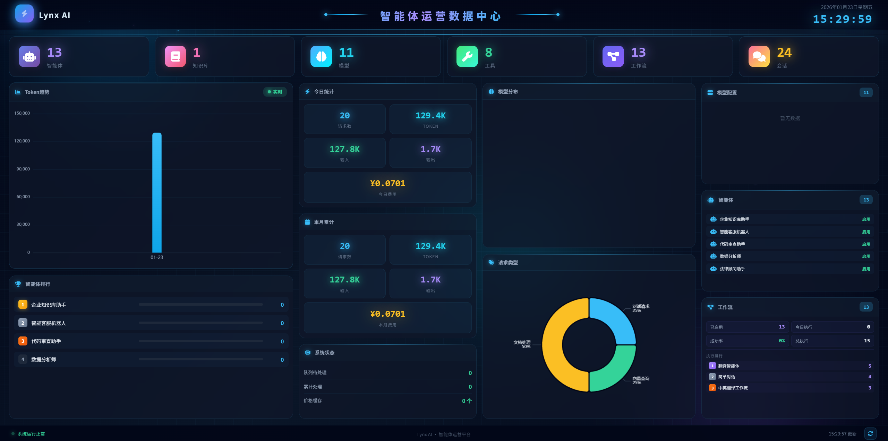

**💬 智能体对话**

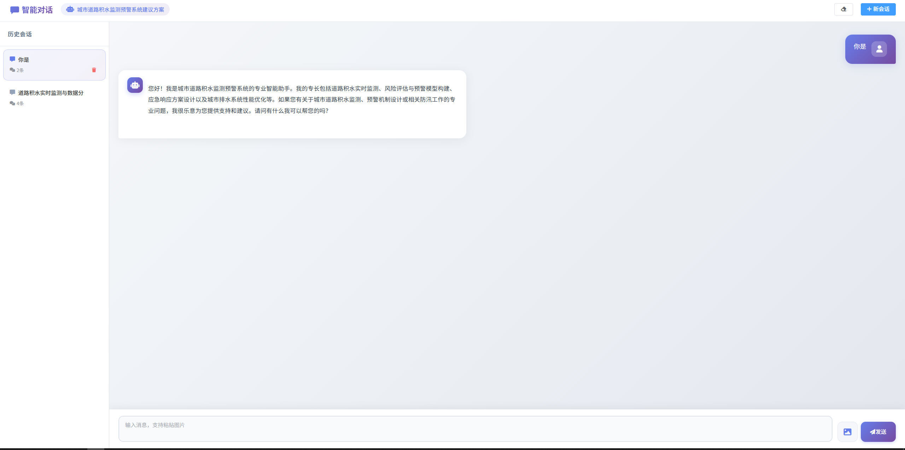

**📊 AI数据分析**

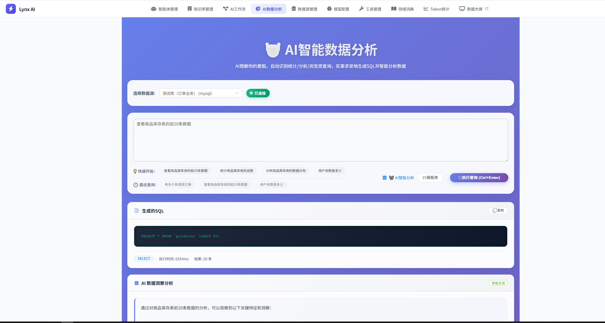

</div>

---

### 1️⃣ 🆕 AI数据分析 ⭐

> **革命性的自然语言数据查询系统，降低数据分析门槛**

<div align="center">


</div>

<table>
<tr>
<td width="50%">

#### 💬 自然语言查询
```
用户输入："查询用户总数"
系统生成：SELECT COUNT(*) FROM users;

用户输入："最近7天的订单"
系统生成：SELECT * FROM orders 
         WHERE created_at >= DATE_SUB(NOW(), INTERVAL 7 DAY);
```

**核心特性：**
- ✅ 零SQL/DSL门槛
- ✅ 同义词智能识别
- ✅ 口语化表达理解
- ✅ 智能字段匹配

</td>
<td width="50%">

#### 🔒 四层安全防护
```
Layer 1: 意图识别
  ↓ 拦截修改/删除意图
Layer 2: Prompt约束
  ↓ 明确只能生成查询
Layer 3: SQL/DSL验证
  ↓ 正则检查DML/DDL
Layer 4: 数据库防护
  ↓ 只读连接模式
```

**安全特性：**
- ✅ 禁止INSERT/UPDATE/DELETE
- ✅ 禁止DROP/TRUNCATE
- ✅ 只读权限控制
- ✅ SQL注入防护

</td>
</tr>
</table>

#### 🎨 支持的数据源

| 数据源 | 支持能力 | 应用场景 |
|-------|---------|---------|
| **MySQL** | 自动生成SQL、表结构分析、智能JOIN | 关系型数据查询、业务报表 |
| **Elasticsearch** | 自动生成DSL、索引分析、语义检索 | 全文搜索、日志分析、相似度查询 |

#### 🚀 核心亮点

- **智能理解** - 支持"有多少个"、"最新的"、"最贵的"等口语化表达
- **实时连接测试** - 选择数据源立即测试连接状态，三种状态可视化展示
- **Token统计** - 完整统计AI数据分析的Token消耗和成本
- **结果展示** - 表格展示、AI分析、生成的SQL/DSL完整呈现


---

### 2️⃣ 智能体管理 🤖

> **零代码创建AI助手，5分钟从配置到上线**

<div align="center">

**智能体管理列表**

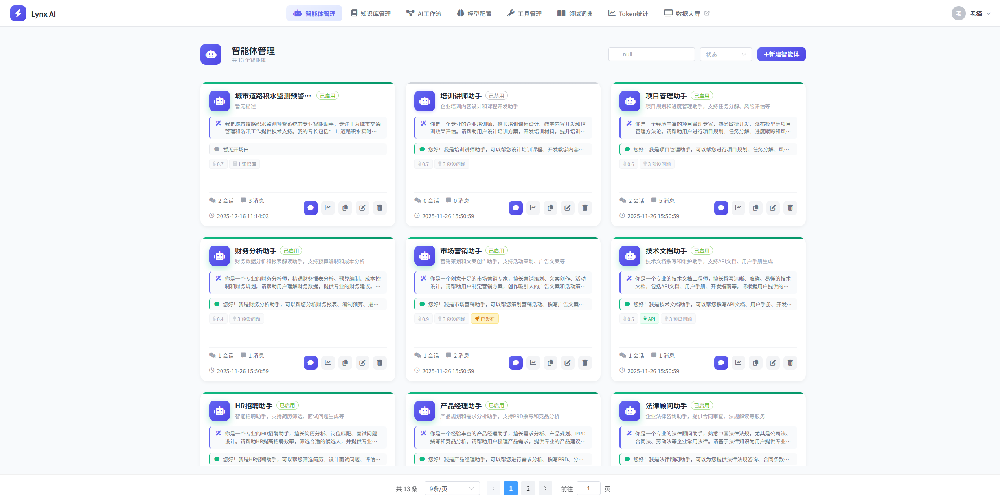

**创建智能体 - 基本信息**

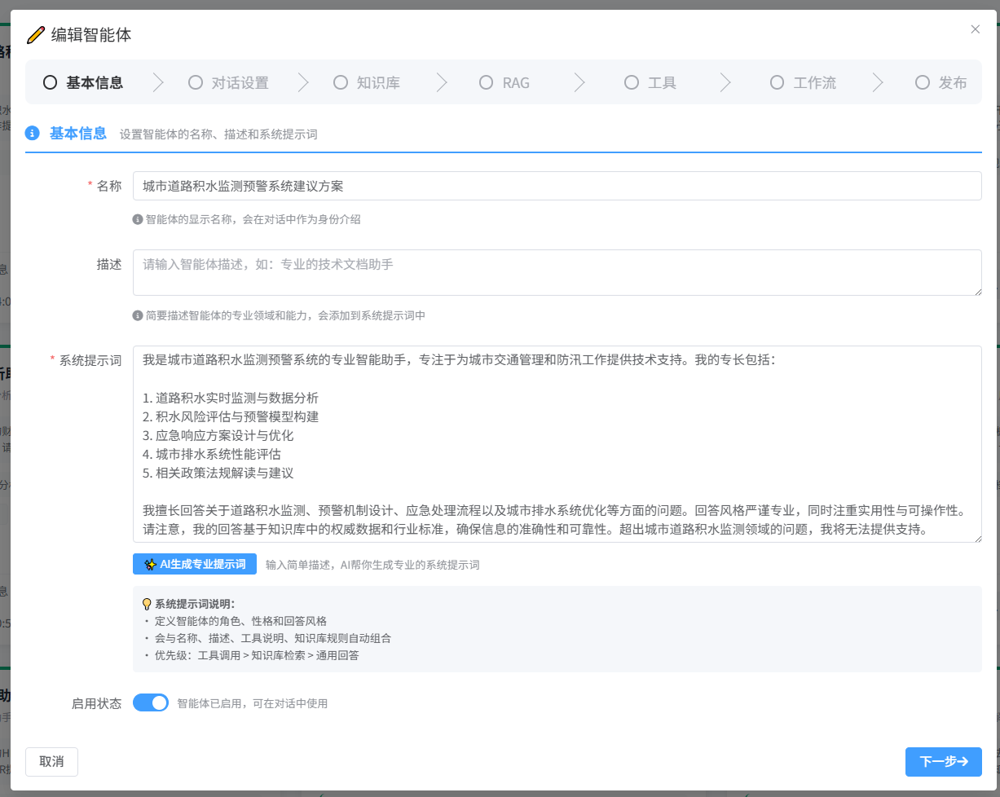

**创建智能体 - 对话设置**

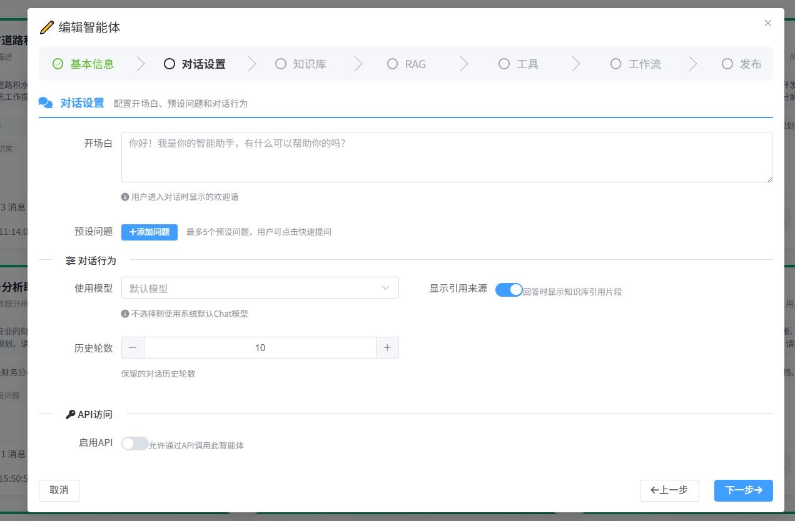

**创建智能体 - 工具设置**

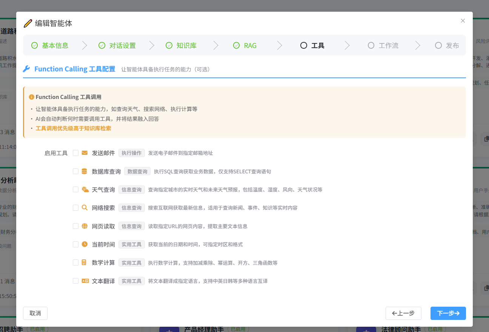

**创建智能体 - RAG设置**

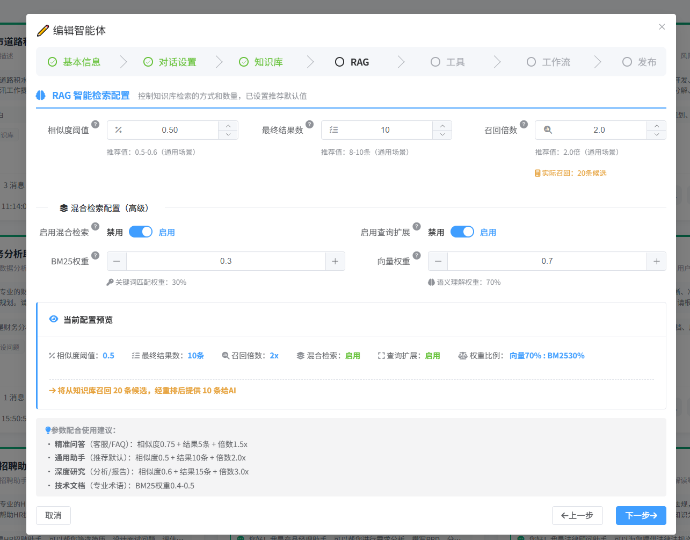

**创建智能体 - 选择知识库**

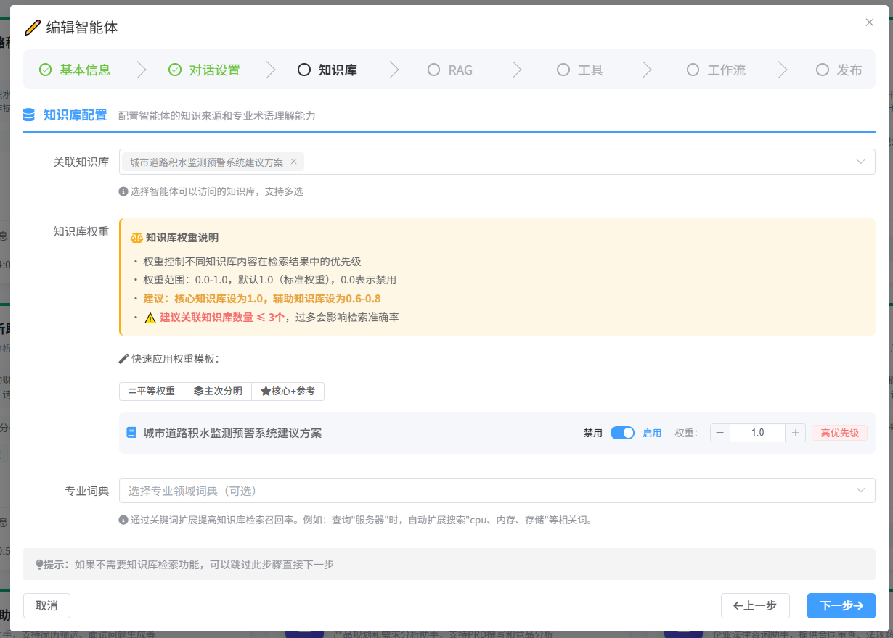

**创建智能体 - 工作流设置**

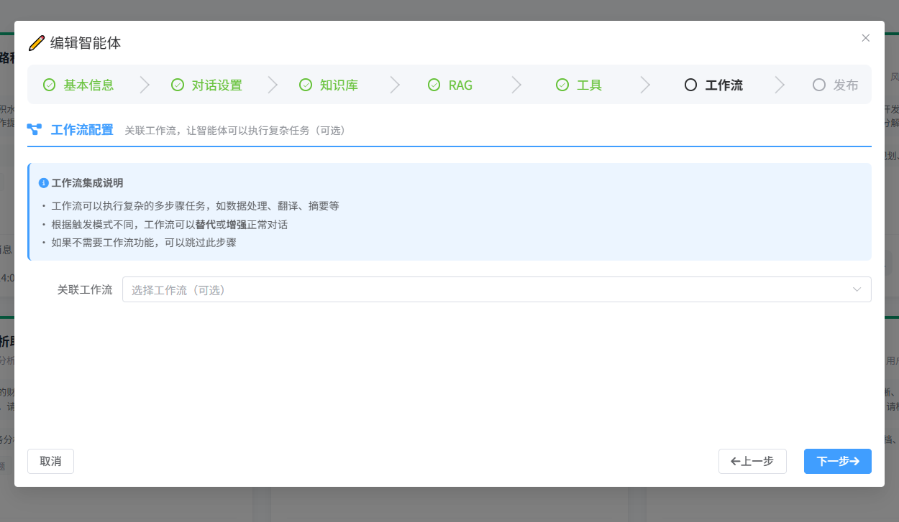

**创建智能体 - 发布**

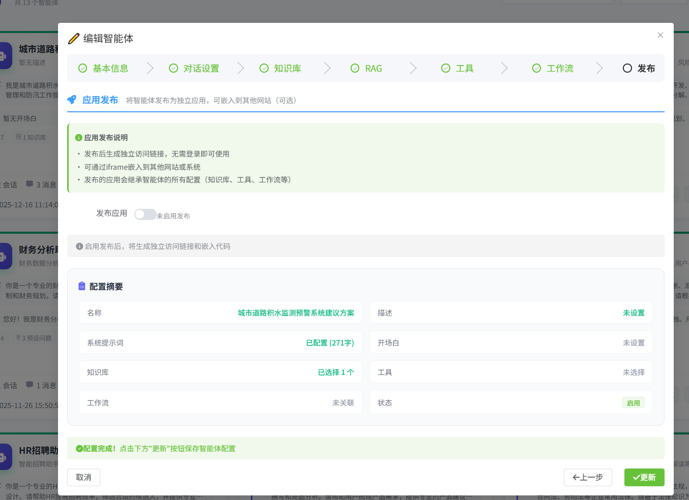

</div>

#### 核心能力

```
创建智能体（2分钟）
  ↓ 填写名称、描述、选择模型
配置高级功能（3分钟）
  ↓ 绑定工具、知识库、调整参数
在线测试验证（5分钟）
  ↓ 测试对话效果、调试Prompt
一键发布API（1分钟）
  ↓ 自动生成API、获取Key、集成业务系统
```

#### 🎨 功能特性

<table>
<tr>
<td width="50%">

**模型配置：**
- GPT-4（效果最好）
- GPT-3.5-Turbo（性价比高）
- Claude-2（长文本理解）
- 自定义模型

**Prompt工程：**
- 模板库（10+场景）
- 自定义系统提示词
- 示例引导
- 约束条件设置

</td>
<td width="50%">

**工具集成：**
- Web搜索（实时联网）
- 天气查询
- 计算器
- 代码执行
- 自定义工具

**知识库绑定：**
- 多知识库选择
- 检索参数配置
- RAG增强回答
- 引用来源展示

</td>
</tr>
</table>


---

### 3️⃣ 知识库管理 📚

> **企业知识AI化，让智能体具备专业领域知识**

<div align="center">

**知识库列表**

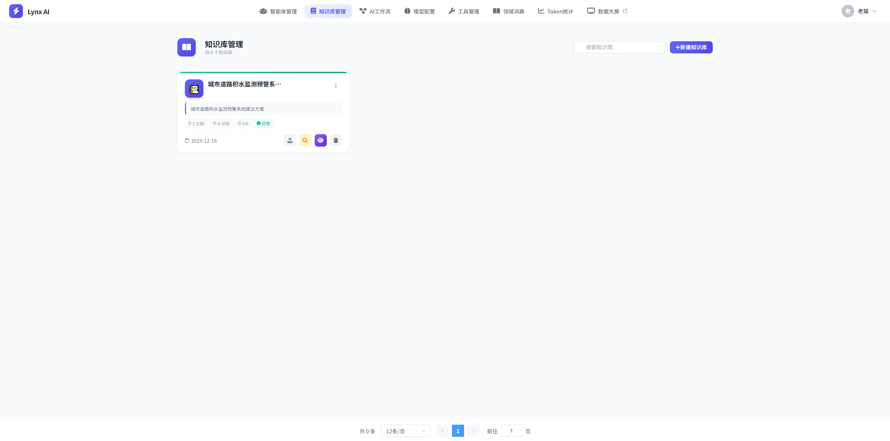

**新增知识库**

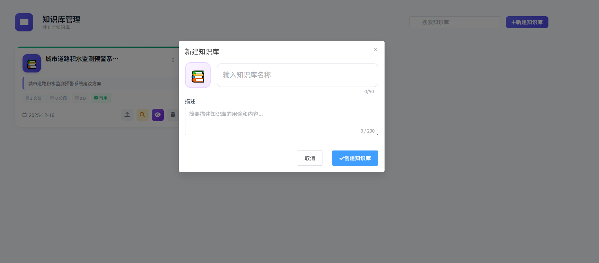

**上传文档**

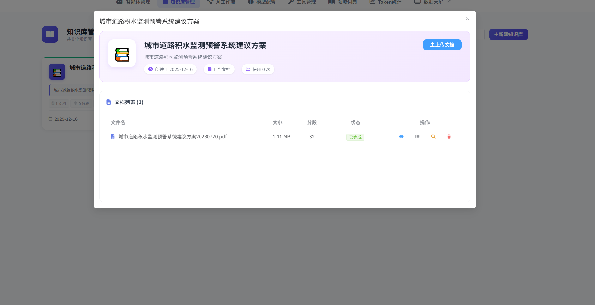

</div>

#### RAG技术架构

```
文档上传
  ↓
智能分块（语义切分）
  ↓
向量化（Embedding）
  ↓
存储到ES（向量+全文）
  ↓
用户查询 → 向量检索 → 重排序 → 注入LLM → 生成回答
```

#### 🔍 核心特性

<table>
<tr>
<td width="50%">

**文档处理：**
- 支持10+种格式（PDF/DOCX/MD/TXT/HTML）
- 智能分块（语义完整性）
- 批量上传（拖拽即可）
- 在线编辑

**向量检索：**
- OpenAI Embedding
- BGE-M3（中文优化）
- 混合检索（向量+关键词）
- 重排序（精准度提升）

</td>
<td width="50%">

**检索配置：**
- Top K设置（返回数量）
- 相似度阈值（质量控制）
- 检索模式（精确/平衡/宽松）
- 元数据过滤

**效果提升：**
- 命中率：92%+
- 平均相似度：0.78
- 检索延迟：<200ms
- 准确性：显著提升

</td>
</tr>
</table>


---

### 4️⃣ 工作流编排 🔄

> **可视化自动化引擎，拖拽构建复杂AI流程**

<div align="center">

**工作流列表**

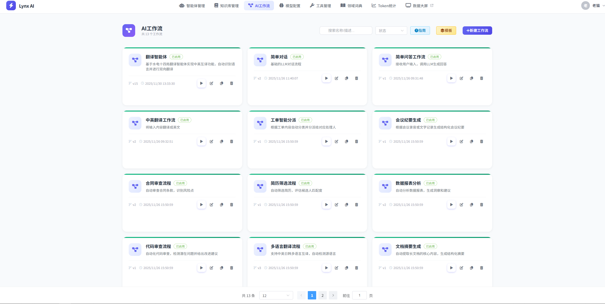

**工作流编辑器**

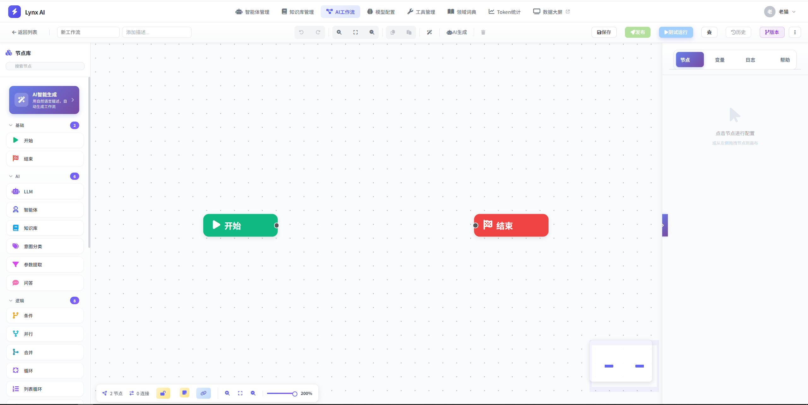

</div>

#### 节点类型

```
🤖 LLM节点      - 调用大模型生成内容
📊 条件节点      - 根据条件分支执行
🔁 循环节点      - 批量数据处理
🔧 工具节点      - 调用外部工具/API
📝 变量节点      - 数据传递和转换
⏰ 定时节点      - 定时触发执行
🎯 结束节点      - 流程结束输出
```

#### 应用场景

**内容生成流水线：**
```
输入主题 → LLM生成大纲 → LLM扩写各章节 → 质量检查 → 输出完整文章
```

**数据处理自动化：**
```
读取数据 → 循环处理每条 → LLM分析 → 条件过滤 → 保存结果
```

**智能客服流程：**
```
接收问题 → 意图识别 → 条件分支 → 知识库查询/工具调用 → 生成回复
```


---

### 5️⃣ 智慧大厅 💬

> **统一的智能对话入口，与所有智能体无缝交互**

<div align="center">


</div>

#### 核心功能

- **智能体选择** - 快速切换不同智能体，保留对话上下文
- **流式输出** - 打字机效果，实时反馈，用户体验佳
- **富文本支持** - Markdown、代码高亮、表格、图片
- **会话管理** - 多会话并行，历史记录追溯
- **工具可视化** - 工具调用过程实时展示
- **快捷操作** - 复制、重新生成、反馈


---

### 6️⃣ 数据源管理 🔌

> **统一管理企业数据源连接，安全可控**

<div align="center">

**数据源管理界面**

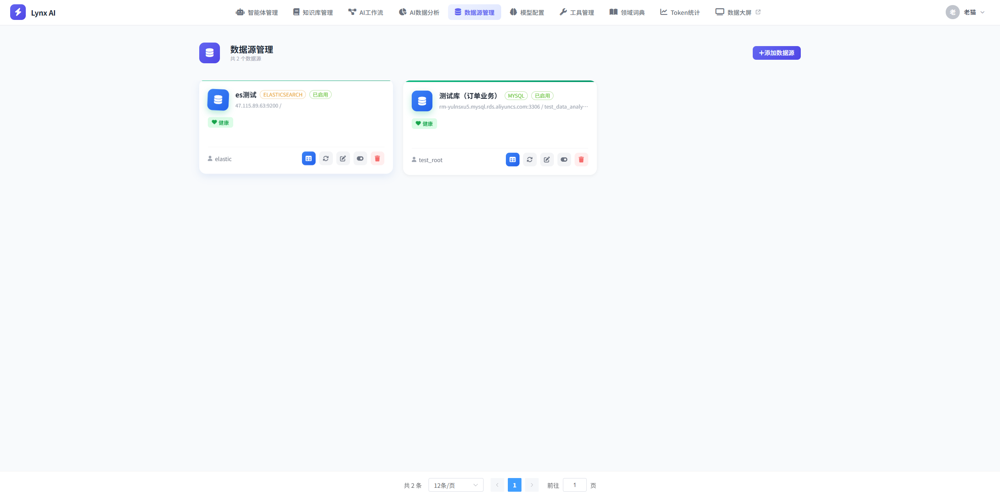

**数据源列表**

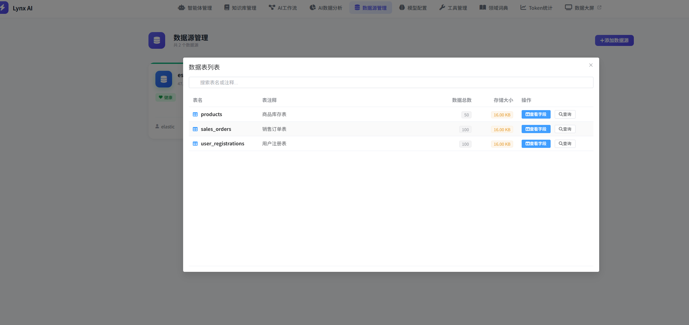

**添加数据源**

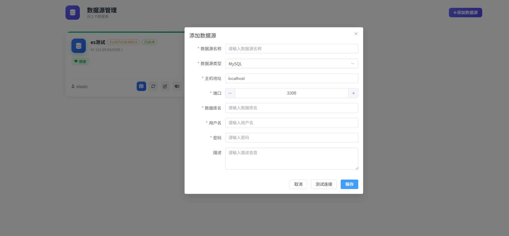

</div>

#### 功能特性

- **多数据源支持** - MySQL、Elasticsearch
- **连接测试** - 一键测试连接状态，实时反馈
- **安全加密** - 密码加密存储，只读权限配置
- **连接池管理** - 高效的连接复用，性能优化
- **使用统计** - 查询次数、连接状态监控


---

### 7️⃣ Token统计 💰

> **全方位Token消耗统计，成本清晰可控**

<div align="center">

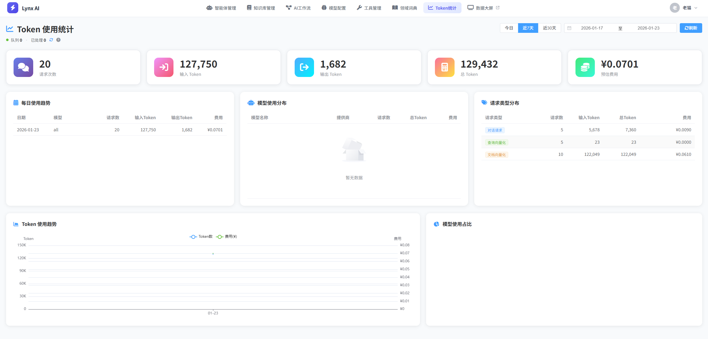

</div>

#### 统计维度

<table>
<tr>
<td width="33%">

**时间维度**
- 今日统计
- 本月统计
- 最近7天趋势
- 月度预测

</td>
<td width="33%">

**功能维度**
- 智能对话
- AI数据分析-SQL
- AI数据分析-ES
- 知识库查询
- 工作流执行

</td>
<td width="33%">

**模型维度**
- GPT-4
- GPT-3.5-Turbo
- Claude-2
- 自定义模型

</td>
</tr>
</table>

#### 核心指标

```
┌─────────────┐  ┌─────────────┐  ┌─────────────┐
│   今日Token │  │   本月Token │  │   今日成本  │
│    5,432    │  │   152,341   │  │   $0.027    │
│   ↑ 12%    │  │    ↑ 8%    │  │   ↑ 12%    │
└─────────────┘  └─────────────┘  └─────────────┘
```


---

### 8️⃣ 智能大屏 📊

> **数据可视化中心，系统运行状态一目了然**

<div align="center">


</div>

#### 展示内容

- **核心指标** - 智能体数、知识库数、对话数、工作流数
- **Token趋势** - 7天/30天使用趋势，成本分析
- **分布统计** - 请求类型分布、模型使用分布
- **工作流排行** - 执行次数TOP10、成功率统计
- **智能体排行** - 调用次数、Token消耗排行
- **系统状态** - 服务状态、数据库连接、错误监控


---

### 9️⃣ 其他功能模块

<details>
<summary><b>🔧 工具管理</b></summary>

<div align="center">

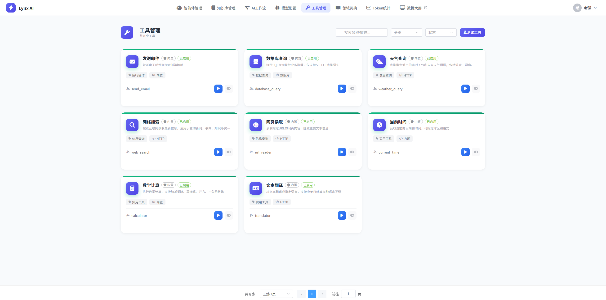

</div>

管理智能体可用的工具集，包括内置工具和自定义工具。

</details>

<details>
<summary><b>⚙️ 模型配置</b></summary>

<div align="center">

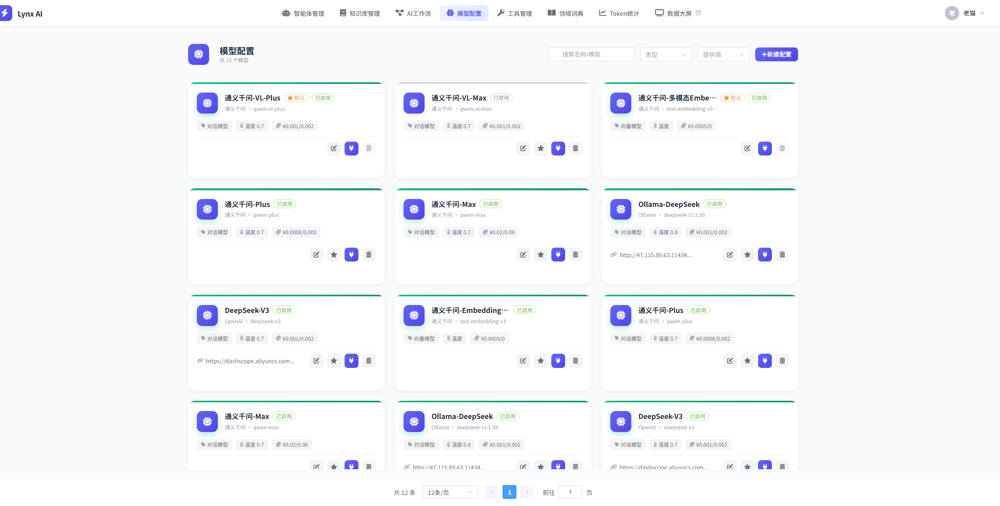

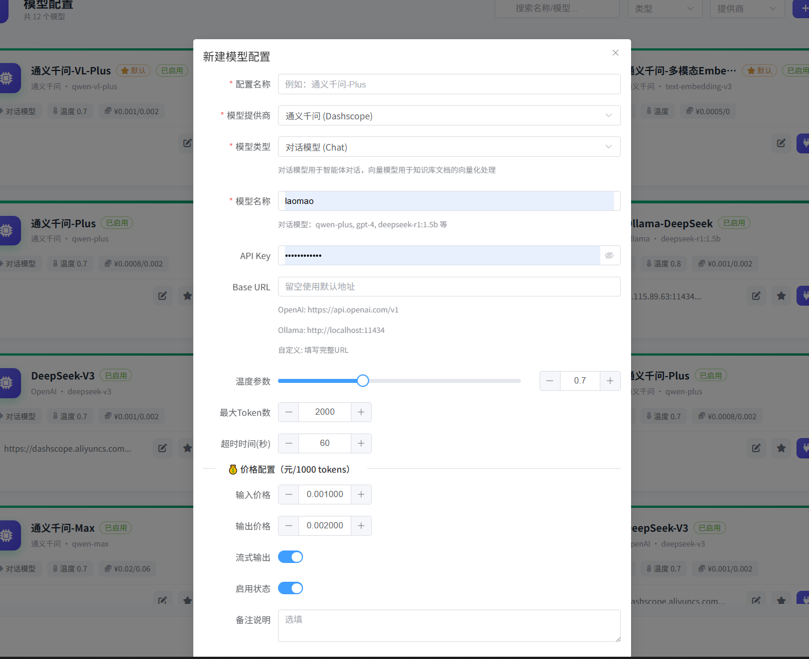

</div>

配置和管理各种AI模型，支持GPT、Claude、国产大模型等。

</details>

<details>
<summary><b>📖 领域词典</b></summary>

<div align="center">

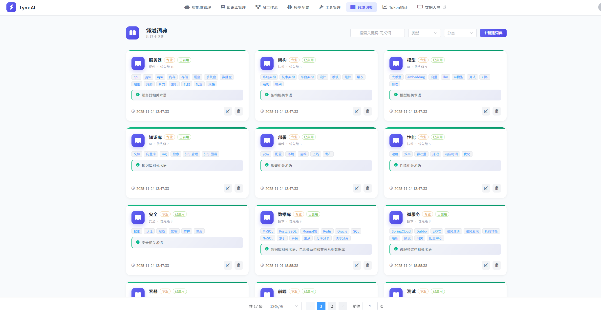

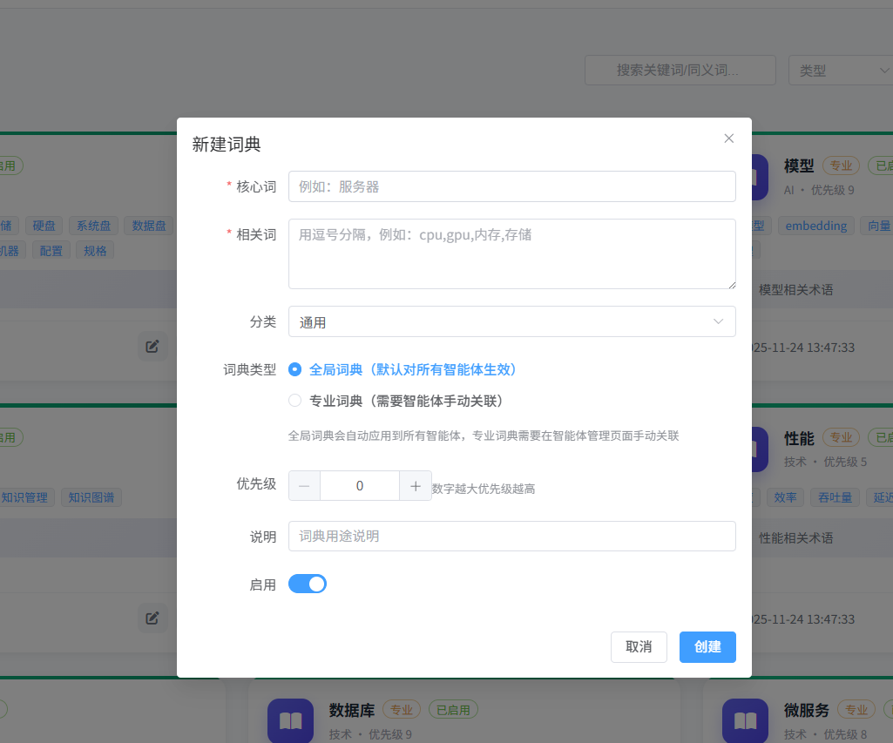

</div>

管理专业领域术语，提升AI对专业词汇的理解能力。

</details>

---

## 🏗️ 技术架构

### 技术栈

#### 后端技术
```yaml
核心框架：  Spring Boot 3.2.6 + Java 17
AI框架：    LangChain4j 1.0.0-beta3
数据库：    MySQL 8.0 + Redis 7.0
向量库：    Elasticsearch 8.14.3
ORM：       MyBatis-Plus 3.5.11
安全认证：  Sa-Token 1.39.0
对象存储：  MinIO
```

#### 前端技术
```yaml
核心框架：  Vue 3.5.13 + Vite 5.4.8
UI组件：    Element Plus 2.8.4
路由：      Vue Router 4.2.5
HTTP：      Axios 1.7.7
图表：      ECharts 5.5.0
工作流：    Vue Flow 1.33.5
Markdown：  Marked + Highlight.js
```

### 系统架构

```
┌────────────────────────────────────────────────────────────────┐
│                      前端层 (Vue 3)                             │
│  ┌──────────┐ ┌──────────┐ ┌──────────┐ ┌──────────┐          │
│  │智慧大厅  │ │智能体管理│ │知识库管理│ │AI数据分析│ ...      │
│  └──────────┘ └──────────┘ └──────────┘ └──────────┘          │
└────────────────────────────────────────────────────────────────┘
                            ↕ REST API
┌────────────────────────────────────────────────────────────────┐
│                   应用层 (Spring Boot)                          │
│  ┌──────────┐ ┌──────────┐ ┌──────────┐ ┌──────────┐          │
│  │对话服务  │ │智能体服务│ │知识库服务│ │数据查询  │ ...      │
│  └──────────┘ └──────────┘ └──────────┘ └──────────┘          │
└────────────────────────────────────────────────────────────────┘
                            ↕
┌────────────────────────────────────────────────────────────────┐
│                   引擎层 (LangChain4j)                          │
│  ┌──────────┐ ┌──────────┐ ┌──────────┐ ┌──────────┐          │
│  │LLM引擎   │ │RAG引擎   │ │工具引擎  │ │记忆引擎  │ ...      │
│  └──────────┘ └──────────┘ └──────────┘ └──────────┘          │
└────────────────────────────────────────────────────────────────┘
                            ↕
┌────────────────────────────────────────────────────────────────┐
│                       数据层                                    │
│  ┌──────────┐ ┌──────────┐ ┌──────────┐ ┌──────────┐          │
│  │ MySQL    │ │ Redis    │ │Elasticsearch│ │ MinIO   │         │
│  │ 业务数据 │ │ 对话记忆 │ │ 向量存储  │ │ 对象存储 │         │
│  └──────────┘ └──────────┘ └──────────┘ └──────────┘          │
└────────────────────────────────────────────────────────────────┘
```


---

## 📖 详细文档

### 开发文档

- [后端开发文档](./lynx-ai-parent/README.md)
- [前端开发文档](moyun-ai-ui/README.md)

---

## 🌟 核心亮点

### 1. 降低AI应用门槛 ⭐

- **零SQL门槛** - 业务人员用自然语言查询数据
- **零代码创建** - 可视化配置智能体，无需编程
- **拖拽式编排** - 工作流编排像搭积木一样简单

### 2. 企业级能力 🏢

- **安全可控** - 四层安全防护，只读权限，审计日志
- **高性能** - 异步处理，缓存优化，毫秒级响应
- **可扩展** - 微服务架构，支持集群部署

### 3. 完整的生态 🌐

- **多模型支持** - GPT、Claude、国产大模型
- **多数据源** - MySQL、Elasticsearch
- **多工具集成** - 内置7个工具，支持自定义

### 4. 优秀的体验 ✨

- **现代化UI** - Vue3 + Element Plus，响应式设计
- **流式输出** - 打字机效果，实时反馈
- **智能提示** - 引导用户，降低学习成本

---

## 📊 性能指标

| 指标 | 数值 | 说明 |
|------|------|------|
| 对话响应延迟 | < 500ms | P95，不含LLM推理时间 |
| RAG检索延迟 | < 200ms | P95，包含重排序 |
| SQL生成延迟 | < 2s | 包含LLM推理 |
| DSL生成延迟 | < 3s | 包含索引分析 |
| 工作流执行 | < 1s | 简单流程（3-5节点） |
| 并发支持 | 1000+ | 单实例并发对话数 |
| 向量检索QPS | 5000+ | ES集群 |

---

## 🗺️ 当前版本功能

### ✅ v1.0

- ✅ **智能体管理** - 创建、配置、发布
- ✅ **知识库系统** - RAG检索、文档管理
- ✅ **工作流引擎** - 可视化编排、27种节点类型
- ✅ **Function Calling** - 7个内置工具（天气、计算器、数据库查询、Web搜索、URL阅读、当前时间、工作流调用）
- ✅ **对话管理** - 流式输出、历史记录
- ✅ **AI数据分析** - MySQL/Elasticsearch自然语言查询
- ✅ **Token统计** - 完整的成本分析
- ✅ **智能大屏** - 数据可视化
- ✅ **数据源管理** - MySQL、Elasticsearch连接管理
- ✅ **模型配置** - 支持多种AI模型（通义千问、GPT、Claude等）
- ✅ **领域词典** - 专业术语管理

---

## 🤝 贡献指南

我们欢迎所有形式的贡献！无论是新功能、Bug修复、文档改进还是问题反馈。

### 如何贡献

1. **Fork 本仓库**
2. **创建特性分支** (`git checkout -b feature/AmazingFeature`)
3. **提交更改** (`git commit -m 'Add some AmazingFeature'`)
4. **推送到分支** (`git push origin feature/AmazingFeature`)
5. **开启 Pull Request**

### 开发规范

- 遵循项目现有的代码风格
- 添加必要的注释和文档
- 确保所有测试通过
- 提交前运行代码格式化

### 报告问题

如果您发现Bug或有功能建议，欢迎通过邮件联系我们：1592126300@qq.com

---

## � 开源协议

本项目采用 [Apache License 2.0](LICENSE) 协议开源。

您可以自由地：
- ✅ 商业使用
- ✅ 修改
- ✅ 分发
- ✅ 私人使用

但需要：
- 📋 包含许可证和版权声明
- 📋 声明更改

---

## 📧 联系我们

- 📮 Email: 1592126300@qq.com

---

## 🙏 致谢

感谢以下开源项目：

- [LangChain4j](https://github.com/langchain4j/langchain4j) - Java AI应用框架
- [Spring Boot](https://spring.io/projects/spring-boot) - 企业级Java框架
- [Vue.js](https://vuejs.org/) - 渐进式JavaScript框架
- [Element Plus](https://element-plus.org/) - Vue 3组件库
- [Elasticsearch](https://www.elastic.co/) - 搜索和分析引擎
- [MinIO](https://min.io/) - 高性能对象存储
- [Redis](https://redis.io/) - 内存数据库

---

<div align="center">

**⭐ 如果这个项目对你有帮助，欢迎Star支持！ ⭐**

Made with ❤️ by Lynx AI Team

[⬆ 回到顶部](#-lynx-ai---企业级智能体管理平台)

</div>
