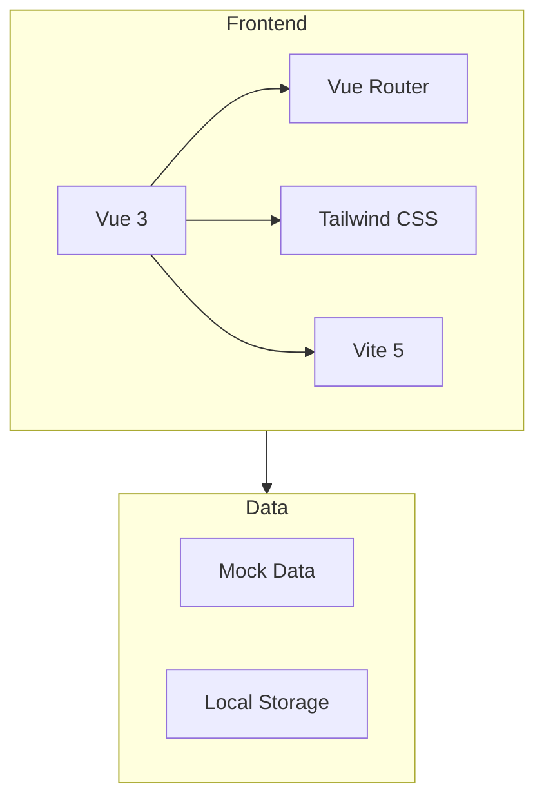
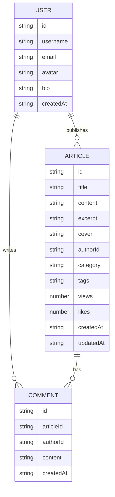

## 1. Architecture Design


## 2. Technology Description
- **前端**: Vue 3.4 + Vue Router 4 + Tailwind CSS 3 + Vite 5
- **初始化工具**: vite-init
- **后端**: 模拟数据（Mock Data）
- **状态管理**: Vue 3 Composition API + reactive/ref
- **图标**: Lucide Vue

## 3. Route Definitions
| Route | Purpose |
|-------|---------|
| / | 首页/列表页 |
| /article/:id | 内容详情页 |
| /search | 搜索页 |
| /user | 个人中心页 |
| /login | 登录页 |
| /register | 注册页 |
| /publish | 内容发布页 |
| /:pathMatch(.*)* | 404页面 |

## 4. API Definitions
使用模拟数据，接口定义如下：

### TypeScript Types
```typescript
interface User {
  id: string;
  username: string;
  email: string;
  avatar: string;
  bio: string;
  createdAt: string;
}

interface Article {
  id: string;
  title: string;
  content: string;
  excerpt: string;
  cover: string;
  author: User;
  category: string;
  tags: string[];
  views: number;
  likes: number;
  createdAt: string;
  updatedAt: string;
}

interface Comment {
  id: string;
  articleId: string;
  author: User;
  content: string;
  createdAt: string;
}
```

## 5. Server Architecture Diagram
不适用（使用模拟数据）

## 6. Data Model
### 6.1 Data Model Definition


### 6.2 Mock Data Structure
使用 TypeScript 定义模拟数据，包含用户、文章、评论等数据。
