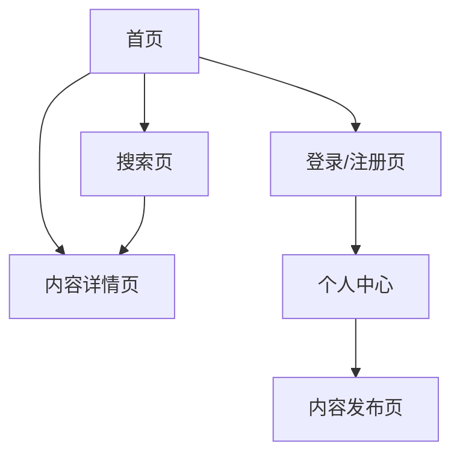

## 1. Product Overview
这是一个功能完整的内容门户网站，包含用户认证、内容浏览、搜索、个人中心和内容发布功能，为用户提供一站式内容管理和浏览体验。

## 2. Core Features

### 2.1 User Roles
| Role | Registration Method | Core Permissions |
|------|---------------------|------------------|
| 普通用户 | 邮箱/密码注册 | 浏览内容、搜索、查看详情、登录注册 |
| 认证用户 | 邮箱/密码登录 | 发布内容、管理个人中心、查看和编辑个人信息 |

### 2.2 Feature Module
1. **首页/列表页**: 内容列表展示、导航栏、搜索入口
2. **详情页**: 内容详情展示、相关推荐、评论功能
3. **搜索页**: 搜索框、搜索结果展示、筛选功能
4. **个人中心页**: 用户信息展示、内容管理、设置
5. **登录注册页**: 登录表单、注册表单、找回密码
6. **内容发布页**: 内容编辑器、分类选择、发布设置
7. **404页面**: 友好的错误提示、返回首页按钮

### 2.3 Page Details
| Page Name | Module Name | Feature description |
|-----------|-------------|---------------------|
| 首页/列表页 | 导航栏 | Logo、导航菜单、用户信息、搜索入口 |
| 首页/列表页 | 内容列表 | 卡片式展示、分页加载、分类筛选 |
| 详情页 | 内容主体 | 标题、作者信息、发布时间、正文内容 |
| 搜索页 | 搜索功能 | 关键词搜索、结果高亮、分类筛选 |
| 个人中心页 | 用户信息 | 头像、昵称、个人资料编辑 |
| 登录注册页 | 表单验证 | 实时验证、错误提示、密码强度检测 |
| 内容发布页 | 编辑器 | 富文本编辑、图片上传、预览功能 |
| 404页面 | 错误提示 | 动画效果、导航链接、返回首页 |

## 3. Core Process
用户访问网站 → 浏览内容列表 → 点击查看详情 → 搜索感兴趣内容 → 注册/登录 → 发布内容 → 管理个人中心

## 4. User Interface Design
### 4.1 Design Style
- **主色调**: 深蓝色 (#165DFF) 和浅蓝渐变
- **辅助色**: 橙色 (#FF7D00) 用于强调
- **按钮风格**: 圆角按钮，悬停时有轻微上浮动画
- **字体**: 思源黑体，标题使用较大字号
- **布局风格**: 卡片式布局，响应式网格
- **图标**: 使用简洁的线性图标

### 4.2 Page Design Overview
| Page Name | Module Name | UI Elements |
|-----------|-------------|-------------|
| 首页/列表页 | 导航栏 | 固定顶部，半透明背景，阴影效果 |
| 首页/列表页 | 内容卡片 | 悬浮效果，图片渐显动画 |
| 详情页 | 内容区域 | 优雅的排版，适当留白 |
| 搜索页 | 搜索框 | 大搜索框，聚焦动画 |
| 登录注册页 | 表单 | 渐变背景，卡片式设计 |
| 内容发布页 | 编辑器 | 工具栏浮动，实时预览 |
| 404页面 | 动画元素 | 弹跳动画，友好提示 |

### 4.3 Responsiveness
- Desktop-first 设计
- 适配 1024px、768px、480px 断点
- 移动端优化触摸交互

### 4.4 3D Scene Guidance
不适用
