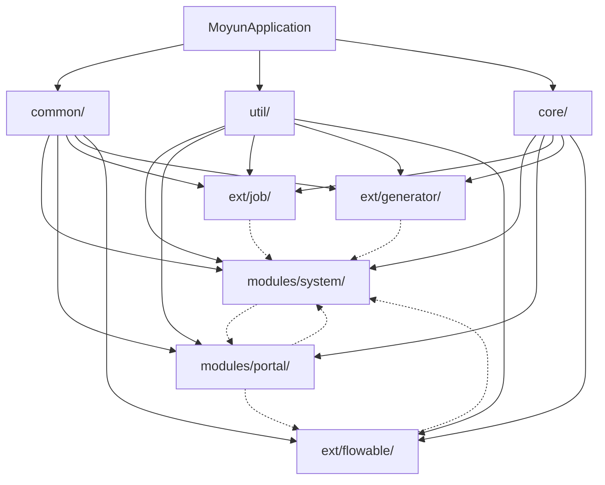
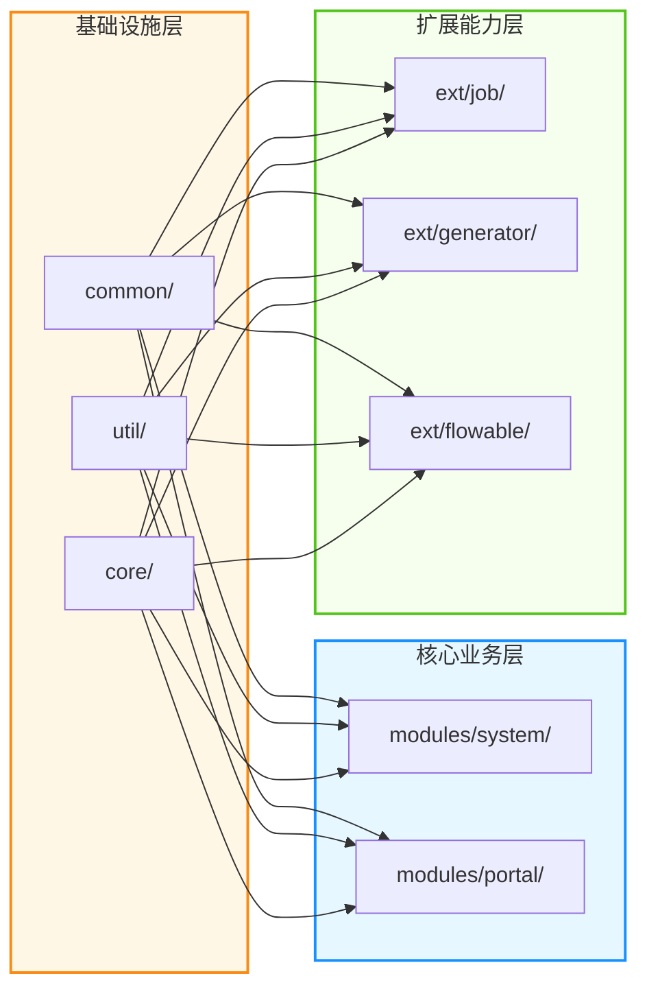
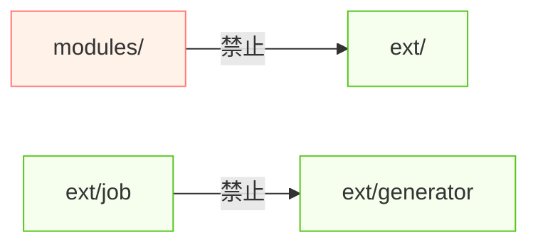

# Moyun Project - 架构优化文档

## 📋 项目概述

Moyun 是一个基于 Spring Boot 3.x 的社区平台系统，包含后端服务（moyun-server）、后台管理系统（moyun-admin-vue）和前台门户（moyun-portal）三个子项目。

本文档详细说明了后端服务（moyun-server）的包结构和架构设计优化。

---

## 🎯 优化目标

1. **模块化设计**：清晰的四层架构，降低模块间耦合度
2. **职责分离**：每个模块职责明确，便于维护和扩展
3. **DDD 思想**：引入领域驱动设计，将 Entity、DTO、VO、Query 分离
4. **可扩展性**：提供插件化的扩展机制，便于功能扩展
5. **统一规范**：统一代码风格和命名规范

---

## 📁 优化后的包结构

```
moyun-server/
├── src/main/java/com/moyun/
│   │
│   ├── common/                  # 通用基础模块
│   │   ├── annotation/          # 注解定义
│   │   ├── constant/            # 常量定义
│   │   ├── enums/              # 枚举类
│   │   ├── exception/          # 异常体系
│   │   │   ├── business/       # 业务异常
│   │   │   │   └── user/       # 用户相关异常
│   │   │   └── system/         # 系统异常
│   │   │       ├── file/       # 文件异常
│   │   │       └── job/        # 定时任务异常
│   │   └── result/             # 统一返回格式
│   │       └── AjaxResult.java
│   │
│   ├── core/                    # 核心框架模块
│   │   ├── base/              # 基础类
│   │   │   ├── BaseController.java
│   │   │   ├── BaseEntity.java
│   │   │   ├── R.java
│   │   │   ├── TableDataInfo.java
│   │   │   ├── TreeEntity.java
│   │   │   ├── TreeSelect.java
│   │   │   ├── entity/        # 核心实体
│   │   │   └── model/         # 核心模型
│   │   │
│   │   ├── config/            # 配置类
│   │   │   ├── ApplicationConfig.java
│   │   │   ├── CaptchaConfig.java
│   │   │   ├── DruidConfig.java
│   │   │   ├── FastJson2JsonRedisSerializer.java
│   │   │   ├── FilterConfig.java
│   │   │   ├── I18nConfig.java
│   │   │   ├── KaptchaTextCreator.java
│   │   │   ├── MyBatisConfig.java
│   │   │   ├── MyMetaObjectHandler.java
│   │   │   ├── MybatisPlusConfig.java
│   │   │   ├── OpenApiConfig.java
│   │   │   ├── RedisConfig.java
│   │   │   ├── ResourcesConfig.java
│   │   │   ├── SecurityConfig.java
│   │   │   ├── SensitiveJsonSerializer.java
│   │   │   ├── ServerConfig.java
│   │   │   ├── ThreadPoolConfig.java
│   │   │   └── TokenConfigValidator.java
│   │   │
│   │   ├── security/           # 安全认证
│   │   │   ├── auth/          # 认证服务
│   │   │   │   ├── SysLoginService.java
│   │   │   │   ├── SysPasswordService.java
│   │   │   │   ├── SysRegisterService.java
│   │   │   │   ├── TokenService.java
│   │   │   │   └── UserDetailsServiceImpl.java
│   │   │   ├── filter/        # 过滤器
│   │   │   │   └── JwtAuthenticationTokenFilter.java
│   │   │   ├── handle/        # 处理器
│   │   │   │   ├── AuthenticationEntryPointImpl.java
│   │   │   │   └── LogoutSuccessHandlerImpl.java
│   │   │   └── permission/    # 权限控制
│   │   │       ├── PermissionService.java
│   │   │       └── SysPermissionService.java
│   │   │
│   │   ├── context/           # 上下文管理
│   │   │   ├── AuthenticationContextHolder.java
│   │   │   └── PermissionContextHolder.java
│   │   │
│   │   ├── mvc/               # MVC相关
│   │   │   ├── handler/        # 异常处理
│   │   │   │   ├── BusinessException.java
│   │   │   │   └── GlobalExceptionHandler.java
│   │   │   └── interceptors/ # 拦截器
│   │   │       ├── RepeatSubmitInterceptor.java
│   │   │       └── SameUrlDataInterceptor.java
│   │   │
│   │   ├── aspectj/           # 切面
│   │   │   ├── DataScopeAspect.java
│   │   │   ├── DataSourceAspect.java
│   │   │   ├── LogAspect.java
│   │   │   └── RateLimiterAspect.java
│   │   │
│   │   ├── datasource/        # 数据源
│   │   │   ├── DynamicDataSource.java
│   │   │   └── DynamicDataSourceContextHolder.java
│   │   │
│   │   ├── manager/          # 管理器
│   │   │   ├── AsyncManager.java
│   │   │   ├── ShutdownManager.java
│   │   │   └── factory/AsyncFactory.java
│   │   │
│   │   └── web/              # Web基础
│   │       ├── common/
│   │       │   ├── CommonController.java
│   │       │   └── FileUploadController.java
│   │       └── domain/
│   │           └── Server.java
│   │
│   ├── util/                  # 独立工具模块
│   │   ├── bean/             # Bean工具
│   │   │   ├── Arith.java
│   │   │   ├── BeanUtils.java
│   │   │   ├── BeanValidators.java
│   │   │   └── PageUtils.java
│   │   ├── cache/            # 缓存工具
│   │   │   └── DictUtils.java
│   │   ├── crypto/            # 加密工具
│   │   │   ├── Base64.java
│   │   │   └── Md5Utils.java
│   │   ├── date/             # 日期工具
│   │   │   └── DateUtils.java
│   │   ├── file/             # 文件工具
│   │   │   ├── ExcelHandlerAdapter.java
│   │   │   ├── ExcelUtil.java
│   │   │   ├── FileTypeUtils.java
│   │   │   ├── FileUploadUtils.java
│   │   │   ├── FileUtils.java
│   │   │   ├── ImageUtils.java
│   │   │   └── MimeTypeUtils.java
│   │   ├── html/             # HTML工具
│   │   │   ├── EscapeUtil.java
│   │   │   ├── HTMLFilter.java
│   │   │   ├── Xss.java
│   │   │   ├── XssFilter.java
│   │   │   ├── XssHttpServletRequestWrapper.java
│   │   │   └── XssValidator.java
│   │   ├── http/             # HTTP工具
│   │   │   ├── HttpHelper.java
│   │   │   ├── HttpUtils.java
│   │   │   └── ServletUtils.java
│   │   ├── ip/               # IP工具
│   │   │   ├── AddressUtils.java
│   │   │   └── IpUtils.java
│   │   ├── json/             # JSON工具（待扩展）
│   │   ├── reflect/          # 反射工具
│   │   │   └── ReflectUtils.java
│   │   ├── security/          # 安全工具
│   │   │   ├── DesensitizedUtil.java
│   │   │   └── SecurityUtils.java
│   │   ├── spring/           # Spring工具
│   │   │   ├── SpringUtils.java
│   │   │   └── Threads.java
│   │   ├── string/           # 字符串工具
│   │   │   ├── ExceptionUtil.java
│   │   │   ├── LogUtils.java
│   │   │   ├── MessageUtils.java
│   │   │   ├── SqlUtil.java
│   │   │   ├── StrFormatter.java
│   │   │   └── StringUtils.java
│   │   ├── uuid/             # UUID工具
│   │   │   ├── IdUtils.java
│   │   │   ├── Seq.java
│   │   │   └── UUID.java
│   │   └── zip/              # 压缩工具（待扩展）
│   │
│   ├── modules/               # 业务模块（核心域）
│   │   │
│   │   ├── system/          # 系统管理模块
│   │   │   ├── controller/  # 控制器
│   │   │   ├── service/     # 业务层
│   │   │   ├── mapper/      # 数据访问层
│   │   │   └── domain/      # 领域模型
│   │   │       ├── entity/  # 实体类
│   │   │       ├── dto/     # 数据传输对象
│   │   │       ├── vo/      # 视图对象
│   │   │       └── query/  # 查询对象
│   │   │
│   │   └── portal/          # 门户模块
│   │       ├── controller/  # 控制器
│   │       ├── service/     # 业务层
│   │       ├── mapper/      # 数据访问层
│   │       └── domain/      # 领域模型
│   │           ├── entity/  # 实体类
│   │           ├── dto/     # 数据传输对象
│   │           ├── vo/      # 视图对象
│   │           └── query/  # 查询对象
│   │
│   ├── ext/                  # 扩展模块（插件机制）
│   │   ├── job/             # 定时任务扩展
│   │   │   ├── config/
│   │   │   ├── controller/
│   │   │   ├── domain/
│   │   │   ├── mapper/
│   │   │   ├── service/
│   │   │   ├── task/
│   │   │   └── util/
│   │   │
│   │   ├── generator/      # 代码生成扩展
│   │   │   ├── config/
│   │   │   ├── controller/
│   │   │   ├── domain/
│   │   │   ├── mapper/
│   │   │   ├── service/
│   │   │   └── util/
│   │   │
│   │   └── flowable/       # 工作流扩展
│   │       ├── config/
│   │       ├── controller/
│   │       ├── domain/
│   │       ├── mapper/
│   │       ├── service/
│   │       ├── factory/
│   │       ├── flow/
│   │       └── listener/
│   │
│   └── MoyunApplication.java # 启动类
│
└── src/main/resources/
    ├── mapper/              # MyBatis XML
    │   ├── system/
    │   ├── portal/
    │   └── ext/
    ├── vm/                  # 代码生成模板
    └── application.yml      # 应用配置
```

---

## 🏗️ 架构设计

### 1️⃣ 模块分层架构

```
┌─────────────────────────────────────────┐
│         Presentation Layer              │
│         (Controller 层)                │
│  接收HTTP请求，参数验证，调用Service     │
└─────────────────┬───────────────────────┘
                  │
┌─────────────────▼───────────────────────┐
│          Business Layer                │
│         (Service 层)                    │
│  处理业务逻辑，事务管理                 │
└─────────────────┬───────────────────────┘
                  │
┌─────────────────▼───────────────────────┐
│           Data Access Layer            │
│         (Mapper 层)                     │
│  数据库操作，CRUD                        │
└─────────────────┬───────────────────────┘
                  │
┌─────────────────▼───────────────────────┐
│           Database                     │
│         (数据库层)                       │
└─────────────────────────────────────────┘
```

### 2️⃣ 模块依赖关系



**依赖规则说明**：
| 模块 | 依赖来源 | 被依赖方 | 说明 |
|------|---------|---------|------|
| **common/** | 无 | 所有模块 | 最底层，不依赖任何模块 |
| **util/** | common/ | 所有模块 | 工具模块，仅依赖 common |
| **core/** | common/, util/ | 业务/扩展模块 | 核心框架，提供安全、MVC等 |
| **modules/system/** | common/, util/, core/ | 无（可选被portal依赖） | 系统管理业务 |
| **modules/portal/** | common/, util/, core/ | 无（可选被ext/flowable依赖） | 门户业务，面向用户 |
| **ext/job/** | common/, util/, core/ | 无（可选依赖system） | 定时任务扩展 |
| **ext/generator/** | common/, util/, core/ | 无（可选依赖system） | 代码生成扩展 |
| **ext/flowable/** | common/, util/, core/ | 无（可选依赖system/portal） | 工作流扩展 |

### 3️⃣ 模块边界清晰化

#### ✅ 业务模块 vs 扩展模块



#### 📖 边界定义表

| 维度 | modules/（业务模块） | ext/（扩展模块） |
|------|---------------------|-----------------|
| **定位** | 核心业务逻辑，系统必需 | 可选功能，按需启用 |
| **生命周期** | 随系统一起部署 | 可独立启用/禁用 |
| **稳定性** | 高稳定，变更需严格测试 | 相对独立，可快速迭代 |
| **耦合度** | 紧密耦合核心框架 | 松耦合，插件式集成 |
| **示例** | 用户管理、文章发布 | 定时任务、工作流、代码生成 |
| **命名约定** | `com.moyun.modules.xxx.*` | `com.moyun.ext.xxx.*` |

#### 🚫 禁止的依赖方向



**禁止规则**：
1. ❌ **业务模块不能依赖扩展模块**（避免核心功能依赖可选功能）
2. ❌ **扩展模块之间不能互相依赖**（保持扩展模块独立）
3. ✅ **扩展模块可以依赖业务模块**（扩展功能增强核心业务）
4. ✅ **业务模块之间可以相互依赖**（合理的业务耦合）

---

## 📦 模块详细说明

### 1. **common** - 通用基础模块

**职责**：提供通用的注解、常量、枚举、异常和返回格式。

**子模块**：
- `annotation/`：自定义注解（@Log, @RateLimiter, @DataScope 等）
- `constant/`：常量定义（用户状态、菜单类型等）
- `enums/`：枚举类（业务状态、操作类型等）
- `exception/`：异常体系
  - `business/`：业务异常
  - `system/`：系统异常
- `result/`：统一返回格式（AjaxResult）

**使用示例**：
```java
// 使用统一返回格式
return AjaxResult.success("操作成功", data);

// 抛出业务异常
throw new ServiceException("业务处理失败");
```

### 2. **core** - 核心框架模块

**职责**：提供核心框架功能，包括配置、安全、MVC、事务等。

**子模块**：
- `base/`：基础类
  - BaseController：控制器基类，提供通用方法
  - BaseEntity：实体基类，包含通用字段
  - R：通用响应类
  - TableDataInfo：分页响应类

- `config/`：Spring 配置类
  - Web 配置：CorsConfig, ResourcesConfig
  - 安全配置：SecurityConfig
  - 数据配置：DruidConfig, MyBatisConfig
  - 缓存配置：RedisConfig

- `security/`：安全认证
  - 认证服务：登录、注册、Token 管理
  - 过滤器：JWT 认证过滤器
  - 权限控制：数据权限、菜单权限

- `mvc/`：MVC 框架扩展
  - 异常处理：GlobalExceptionHandler
  - 拦截器：防重复提交、同 URL 拦截

- `aspectj/`：AOP 切面
  - 日志切面：操作日志记录
  - 限流切面：接口限流
  - 数据权限切面：数据范围过滤

### 3. **util** - 工具模块

**职责**：提供各类工具类，按功能划分。

**子模块**：
- `bean/`：Bean 操作工具（Arith, PageUtils）
- `cache/`：缓存工具（DictUtils）
- `crypto/`：加密工具（Base64, Md5Utils）
- `date/`：日期工具（DateUtils）
- `file/`：文件工具（ExcelUtil, FileUploadUtils）
- `html/`：HTML 工具（XssFilter, HTMLFilter）
- `http/`：HTTP 工具（HttpUtils, ServletUtils）
- `ip/`：IP 工具（AddressUtils, IpUtils）
- `security/`：安全工具（DesensitizedUtil, SecurityUtils）
- `spring/`：Spring 工具（SpringUtils, Threads）
- `string/`：字符串工具（StringUtils, SqlUtil）
- `uuid/`：UUID 工具（IdUtils, UUID）

**使用示例**：
```java
// 字符串工具
StringUtils.isNotEmpty(str);

// 日期工具
DateUtils.formatDate(new Date(), "yyyy-MM-dd");

// 文件工具
ExcelUtil.importExcel(file, clazz);
```

### 4. **modules** - 业务模块

#### 4.1 **system** - 系统管理模块

**职责**：提供系统管理功能，包括用户、角色、菜单、部门等。

**DDD 领域划分**：
```
system/domain/
├── entity/      # 实体类（SysUser, SysRole, SysMenu 等）
├── dto/         # 数据传输对象（UserCreateDTO, UserUpdateDTO）
├── vo/         # 视图对象（UserVO, RoleVO, MenuVO）
└── query/      # 查询对象（UserQuery, RoleQuery）
```

**核心功能**：
- 用户管理（CRUD、密码管理、角色分配）
- 角色管理（权限分配、数据权限）
- 菜单管理（菜单路由、按钮权限）
- 部门管理（树形结构、部门配置）
- 字典管理（字典类型、字典数据）
- 参数管理（系统参数配置）
- 通知公告（系统通知）
- 操作日志（业务操作记录）
- 登录日志（用户登录记录）
- 在线用户（会话管理）

#### 4.2 **portal** - 门户模块

**职责**：提供社区平台的核心业务功能。

**DDD 领域划分**：
```
portal/domain/
├── entity/      # 实体类（PortalArticle, PortalUser 等）
├── dto/         # 数据传输对象（ArticlePublishDTO, UserRegisterDTO）
├── vo/         # 视图对象（ArticleVO, UserVO）
└── query/      # 查询对象（ArticleQuery, UserQuery）
```

**核心功能**：
- 用户模块（注册、登录、个人中心）
- 文章模块（发布、编辑、删除、审核）
- 分类模块（分类管理、层级结构）
- 标签模块（标签管理、热门标签）
- 评论模块（评论、回复、点赞）
- 关注模块（关注、粉丝）
- 收藏模块（收藏、收藏夹）
- 通知模块（系统通知、互动通知）
- 钱包模块（余额、充值、消费）
- VIP 模块（VIP套餐、会员管理）
- 订单模块（订单管理、支付）

### 5. **ext** - 扩展模块

**职责**：提供可选的扩展功能，支持插件化集成。

#### 5.1 **ext/job** - 定时任务扩展

**功能**：
- 任务管理（创建、编辑、删除、暂停、恢复）
- 任务调度（Cron 表达式、分布式调度）
- 任务日志（执行记录、错误追踪）
- 任务执行（同步执行、异步执行、并发控制）

#### 5.2 **ext/generator** - 代码生成扩展

**功能**：
- 表管理（数据表配置、字段配置）
- 代码生成（Controller、Service、Mapper、Entity）
- 模板管理（自定义生成模板）
- 预览和下载

#### 5.3 **ext/flowable** - 工作流扩展

**功能**：
- 流程定义（流程设计、部署、版本管理）
- 流程实例（启动、审批、驳回、转交）
- 流程任务（待办任务、已办任务、我的申请）
- 表单配置（动态表单、流程表单）
- 表达式配置（条件表达式、脚本）
- 监听器配置（事件监听、执行监听）

---

## 🎯 DDD 分层设计

### Domain 层职责

```
┌─────────────────────────────────────────┐
│            Controller                   │
│   接收请求，参数校验，调用 Service       │
└─────────────────┬───────────────────────┘
                  │
┌─────────────────▼───────────────────────┐
│            Service                      │
│   业务逻辑处理，事务管理                 │
└─────────────────┬───────────────────────┘
                  │
┌─────────────────▼───────────────────────┐
│           Domain                        │
│   ┌─────────────────────────────────┐   │
│   │  DTO → Entity → VO             │   │
│   │  数据传输对象到实体到视图对象    │   │
│   └─────────────────────────────────┘   │
└─────────────────┬───────────────────────┘
                  │
┌─────────────────▼───────────────────────┐
│           Mapper                        │
│   数据库操作                             │
└─────────────────────────────────────────┘
```

### DTO、VO、Query 区别

| 类型 | 全称 | 用途 | 字段 |
|------|------|------|------|
| **DTO** | Data Transfer Object | 数据传输对象，用于前后端数据交换 | 包含业务需要的字段 |
| **VO** | View Object | 视图对象，用于返回给前端展示 | 包含展示需要的字段 |
| **Query** | Query Object | 查询对象，用于封装查询条件 | 包含查询条件字段 |

**使用示例**：
```java
// Controller
@PostMapping("/publish")
public AjaxResult publish(@RequestBody ArticlePublishDTO dto) {
    return AjaxResult.success(articleService.publish(dto));
}

// Service
public ArticleVO publish(ArticlePublishDTO dto) {
    // DTO 转 Entity
    PortalArticle article = BeanUtil.copyProperties(dto, PortalArticle.class);
    // 业务处理...
    // Entity 转 VO
    return BeanUtil.copyProperties(article, ArticleVO.class);
}

// Controller
@GetMapping("/list")
public TableDataInfo list(ArticleQuery query) {
    startPage();
    List<ArticleVO> list = articleService.selectArticleList(query);
    return getDataTable(list);
}
```

---

## 🔧 扩展机制

### 1. 插件化设计

ext 模块提供了插件化的扩展机制：

```java
// 可选的扩展模块
@EnableAsync                    // 启用异步任务
@MapperScan({"com.moyun.modules.*.mapper"})  // 扫描所有 Mapper
```

### 2. 配置开关

可以通过配置启用/禁用扩展功能：

```yaml
# application.yml
moyun:
  # 定时任务
  job:
    enabled: true
    
  # 代码生成
  generator:
    enabled: true
    
  # 工作流
  flowable:
    enabled: true
```

### 3. 自定义扩展

添加新的扩展模块：

```
ext/
└── your-module/       # 你的扩展模块
    ├── config/        # 配置类
    ├── controller/    # 控制器
    ├── service/      # 服务层
    ├── domain/       # 领域模型
    ├── mapper/       # 数据访问层
    └── ...
```

---

## 📊 项目统计

| 模块 | 文件数 | 主要功能 |
|------|--------|---------|
| **common** | ~25 | 通用基础组件 |
| **core** | ~70 | 核心框架 |
| **util** | ~40 | 工具类 |
| **modules/system** | ~100 | 系统管理 |
| **modules/portal** | ~90 | 门户业务 |
| **ext/job** | ~20 | 定时任务 |
| **ext/generator** | ~15 | 代码生成 |
| **ext/flowable** | ~30 | 工作流 |
| **总计** | **~390** | **完整的社区平台** |

---

## 🚀 使用指南

### 1. 添加新模块

在 `modules/` 下创建新模块：

```bash
mkdir -p modules/your-module/{controller,service,mapper,domain/{entity,dto,vo,query}}
```

### 2. 添加新实体

```java
// entity/YourEntity.java
@Data
@TableName("your_table")
public class YourEntity extends BaseEntity {
    // 字段定义
}
```

### 3. 添加新 DTO

```java
// dto/CreateYourDTO.java
@Data
@Schema(description = "创建DTO")
public class CreateYourDTO {
    @NotBlank(message = "名称不能为空")
    @Schema(description = "名称")
    private String name;
}
```

### 4. 添加新 Service

```java
// service/IYourService.java
public interface IYourService {
    // 方法定义
}

// service/impl/YourServiceImpl.java
@Service
public class YourServiceImpl extends ServiceImpl<YourMapper, YourEntity> implements IYourService {
    // 方法实现
}
```

---

## 📝 注意事项

1. **包命名规范**：
   - `com.moyun.common.*` - 通用组件
   - `com.moyun.core.*` - 核心框架
   - `com.moyun.util.*` - 工具类
   - `com.moyun.modules.xxx.*` - 业务模块
   - `com.moyun.ext.xxx.*` - 扩展模块

2. **分层职责**：
   - Controller：参数校验、调用 Service、返回响应
   - Service：业务逻辑、事务管理
   - Mapper：数据库操作
   - Domain：数据模型（Entity、DTO、VO、Query）

3. **代码规范**：
   - 使用 Lombok 简化代码
   - 添加 Swagger 注解
   - 添加 JSR-303 验证注解
   - 编写完整的 Javadoc 注释

4. **性能优化**：
   - 合理使用缓存
   - 避免 N+1 查询
   - 使用分页查询
   - 合理使用索引

---

## 🎓 学习资源

- [Spring Boot 官方文档](https://spring.io/projects/spring-boot)
- [MyBatis-Plus 官方文档](https://baomidou.com/)
- [DDD 领域驱动设计](https://book.douban.com/subject/5344973/)
- [若依框架文档](http://doc.ruoyi.vip/)

---

## 📧 联系方式

如有问题，请联系项目维护者。

---

**版本**：1.0.0  
**更新日期**：2026-05-25  
**作者**：Moyun Team
